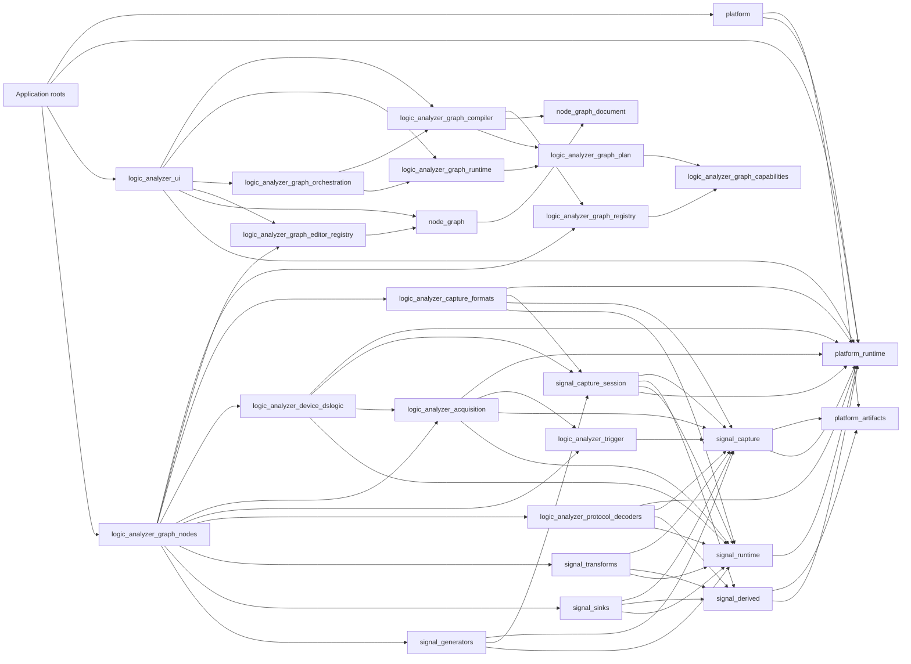
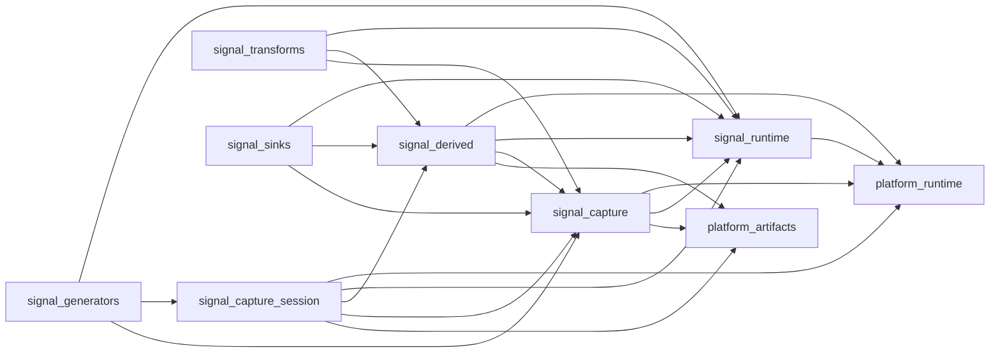

# Crate Responsibilities

## Purpose

This document is the workspace-level guide to crate ownership and dependency direction. Each crate
has one primary responsibility and an explicit boundary. The crate-specific designs and Rustdoc
facades provide detailed contracts; the cross-cutting designs in `docs/aspects/` define rules that
intentionally involve several owners.

Terms such as *graph document*, *lowering*, *processing graph*, *graph run*, *payload*, *capture*,
and *derived lane* have the meanings defined in
[Vocabulary and Concepts](vocabulary_and_concepts.md). The distributed runtime behavior is shown
in [Processing Graph Workflows](processing_workflows.md).

## Crate guide

Each entry names the capability the crate owns and the principal contract it hands to adjacent
layers. An exclusion is stated only when that boundary is easy to misunderstand.

### Generic platform, signal, and data-plane crates

#### `platform-artifacts`

Owns platform-neutral immutable byte regions, artifact and source identities, repository contracts,
in-memory repository behavior, replication, checksums, and persistence time primitives. Physical
filesystem or browser storage is supplied through the repository contract. It hands
`PreparedByteSource`, `ArtifactRepository`, and replication contracts to capture, derived-data,
session, and graph-runtime owners.

#### `platform-runtime`

Owns platform-neutral work execution and worker-operation contracts, serializable request and
result envelopes, registered finite-operation kernels, explicit inline/cooperative fallbacks, and
the target-independent bounded worker queue. It hands `WorkExecutor`, `WorkerOperation`, kernel
registration, and bounded queue contracts to portable processing owners and their host adapters.

#### `signal-runtime`

Owns generic typed-stream execution: process-node lifecycle, named ports, channels, pipeline
wiring, scheduling, and threaded and cooperative managers. Its crate root is the supported
execution facade. `ProcessNodeConstruction` couples a constructed process with owner-defined
metadata without introducing an umbrella processing crate. `NodeWorkError` retains owner-specific
typed work failures through cloneable `WorkError` and `NodeFailure` values. It hands `ProcessNode`,
port schemas, `AppManagerFactory`, and source-bearing work failures to portable node libraries and
graph execution.

#### `signal-capture`

Owns generic immutable capture payloads, capture data-source and query contracts, random-access
signal capabilities, opaque provider-owned channel identities, transition queries, and finite
waveform indexing. Its crate root hands `CaptureDataSource`, `CaptureIndex`, query contracts, and
index factories to capture formats, sessions, graph execution, and viewers.

#### `signal-derived`

Owns presentation-neutral retained outputs: generic derived payloads, payload adapters, collection,
lane catalogs, bounded queries, sampling-point stores, indexes, and encoded derived storage.

Its public `derived_word_store` module owns the indexed annotation format, append and query
contracts, persistent publication, reopening, and storage administration. The crate hands payload,
collection, lane-query, indexing, and storage contracts to protocol decoders, graph execution, and
presentation owners.

#### `signal-capture-session`

Owns generic acquisition and recording lifecycles plus lazy capture-source metadata, lifecycle,
presentation, and cache-identity contracts. Its public modules are domain facades:

- `live_capture` defines provider-neutral acquisition configuration, commands, events, progress,
  bounded delivery, and terminal outcomes;
- `live_capture_store` defines append-only recording, committed-prefix reading, finalization,
  recovery, and session-repository contracts.

It hands capture-source metadata, acquisition events, finalized captures, and `CaptureStore`
contracts to source implementations and application capture coordination.

#### `signal-transforms`

Owns portable UI-independent stream transformations and control primitives. Each public module is
one transform family. It hands configured `ProcessNode` implementations to graph-node runtime
builders.

#### `signal-sinks`

Owns portable terminal stream consumers and output encodings. File-producing sinks consume the
injected `OutputStorage` destination contract. It hands configured sink `ProcessNode`s and the
destination port to graph features and application composition.

#### `signal-generators`

Owns explicit deterministic capture and UART-like signal generation for authored demonstrations,
tests, and scenarios. It hands portable capture-source and process-node implementations to graph
features. Generators are selected through configuration and are not implicit host fallbacks.

#### `logic-analyzer-capture-formats`

Owns DSL and Sigrok archive parsing, capture indexing, and finite replay sources. It consumes
prepared byte sources and artifact/work capabilities. It hands format-specific source factories,
generic `CaptureDataSource` implementations, and replay process nodes to concrete graph features.

#### `logic-analyzer-trigger`

Owns serializable trigger programs, provider schemas, registered predicates, stable identifiers,
simple digital conditions, edit classification, and validation diagnostics. It depends only on the
opaque channel identity from `signal-capture`. It hands `TriggerProgram`, provider schemas, edits,
and diagnostics to acquisition providers, graph features, and trigger presentation.

#### `logic-analyzer-acquisition`

Owns device-neutral logic-analyzer driver and capture-configuration contracts, hardware-trigger
values, raw chunks, and the reusable runtime source adapter. It hands `LogicAnalyzer`,
`LogicCaptureConfig`, and `LogicAnalyzerSource` contracts to device implementations and capture
source factories.

#### `logic-analyzer-device-dslogic`

Owns the DSLogic U3Pro16 protocol, acquisition planning, packet conversion, and processing source.
It hands the concrete U3Pro16 capture-source factory and its neutral USB/FPGA-image input ports to
graph-node and application composition. Native composition adapts generic `platform` mechanisms to
those device-owned ports.

#### `logic-analyzer-protocol-decoders`

Owns UI-independent protocol packet values, packet framing, and I²C, parallel, Sigrok, SPI, and
UART decoding state machines plus their runtime configuration and host contracts. Sigrok execution
startup and running lifecycle failures retain host-adapter causes through owner-typed contracts.
It hands configured decoder `ProcessNode`s, protocol packet values, and Sigrok execution contracts
to concrete graph features and host composition.

### Graph crates

#### `logic-analyzer-graph-capabilities`

Owns contracts implemented by graph-node and payload features. The public `node` module contains
the capability traits for document semantics, runtime materialization, capture and live features,
timeline behavior, and presentation. The public `node_support` module contains their neutral values
and restricted build services, including port kinds, resolved inputs, capture identities, and
presentation descriptors. It hands capability traits and neutral build values to graph features,
the registry, compiler, runtime plan, and UI services.

#### `logic-analyzer-graph-registry`

Owns graph-node and payload registration descriptors; compile-time
inventory collection; deterministic validation; runtime capability overrides; and immutable
`GraphRegistry` snapshots. It hands validated immutable capability catalogs to the compiler and
application composition. Editor definitions remain in `logic-analyzer-graph-editor-registry`,
because headless registry consumers must not acquire an egui dependency.

#### `logic-analyzer-graph-nodes`

Owns the enabled built-in graph feature bundle: concrete node definitions, serialized state,
migrations, capability implementations, runtime builders, payload registrations, socket styling,
and presentation metadata. It hands compile-time graph and payload registrations plus editor
definitions to their registries, keeping generic compiler, runtime, viewer, and editor code
independent of concrete nodes and protocols.

#### `logic-analyzer-graph-plan`

Owns the neutral immutable boundary between graph planning and execution. `ProcessingGraph` carries
resolved runtime nodes and edges, materializer handles, payload materialization, output
subscriptions, source lifecycle, cache identity, and sampling metadata. It hands a complete
`ProcessingGraph` from compiler or worker planning to graph runtime; the plan deliberately owns no
editable-document or active-run state.

#### `logic-analyzer-graph-compiler`

Owns graph-document semantic analysis, discovery, validation, capability negotiation, diagnostics,
and lowering into `ProcessingGraph`. `GraphLowerer` reads an immutable registry snapshot and an
explicit output-subscription plan. It hands either a validated `ProcessingGraph` or stable-identity
diagnostics to application and worker orchestration.

#### `logic-analyzer-graph-runtime`

Owns source preparation, cache execution planning, processing-graph materialization, generated
collector materialization, graph-run lifecycle, progress and diagnostics, and live plan
reconciliation. It consumes a complete `ProcessingGraph` and injected repository, executor, and
runtime-manager services. It hands `GraphRun`, run data, readiness, progress, and diagnostics to
application or worker orchestration. Its direct consumption of the immutable plan—rather than the
compiler or editable document—is the execution boundary.

#### `logic-analyzer-graph-orchestration`

Owns the application-neutral worker protocol, codecs, client lifecycle, and worker-side composition
of graph lowering and execution. It hands worker requests, observations, a client, and a composed
worker runtime to application roots and UI graph services while leaving graph semantics and plan
contracts with their respective owners.

### Reusable document, widget, and application crates

#### `node-graph-document`

Owns portable graph records, stable graph identities, neutral presentation values, saved-document
serialization, semantic snapshots, and document-local invariants. It hands `GraphState` and its
record/identity vocabulary to the reusable editor, compiler, plug-ins, and application document
services.

#### `node-graph`

Owns the generic node-definition registry, definition reconciliation, editor interaction, and egui
graph widget. Its public `api` module exposes node and socket definitions, controls, panel actions,
and the portable file-dialog contract. Portable records come from `node-graph-document` and are
re-exported for widget consumers. The crate hands `NodeDef`, `NodeTypeRegistry`, and related editor
contracts through `node_graph::api`, and hands `NodeGraphWidget` plus editor preferences/actions
through the crate root to UI composition. It deliberately receives concrete behavior as metadata
and contracts rather than branching on node or protocol names.

#### `logic-analyzer-graph-editor-registry`

Owns stable-ID-keyed node-editor definition inventory and instance-bound editor overrides. It is
the Logic Conduit integration seam around the reusable widget. It hands validated editor
registrations to UI registry construction while the headless graph tier continues to consume only
graph capability registrations.

#### `logic-analyzer-viewer`

Owns generic waveform and derived-lane presentation, viewport interaction, row organization,
cursor and edge measurements, visible-window sampling, sampling overlays, and renderer
registrations. It hands `LogicAnalyzerViewer`, query/presentation contracts, and renderer
registries to UI composition. It consumes explicit renderer keys and presentation metadata and
never infers protocol behavior from names or values.

#### `panel-layout`

Owns a reusable egui panel layout: its persistent tree, split placement, content selection,
dragging, closing, maximizing, and boundary menus. Panel and content identifiers are opaque;
application panel identity and behavior belong to the host. It hands `PanelLayout`, opaque panel
specifications, layout persistence, and interaction results to any egui application through its
crate-root facade.

#### `trigger-editor`

Owns the generic schema-driven editor for provider-neutral trigger programs. It renders trigger
contracts and applies validated edits through its program reducer. It hands `TriggerEditor` and
edit results to UI composition; predicate meaning remains provider-owned metadata.

#### `widget-support`

Owns small application-neutral presentation helpers shared by reusable egui widgets. It hands menu,
icon, and related visual primitives to widget crates without introducing an application-level
widget facade.

#### `input-bindings`

Owns portable input-binding configuration, lookup, and shortcut presentation. Context and action
identities are opaque strings. It hands resolved triggers and displayable shortcuts to reusable
widgets and application input dispatch.

#### `logic-analyzer-ui`

Owns portable application interaction and panel composition. It coordinates the graph editor,
viewer, output selection, Run and live-apply workflow, documents, menus, panels, and application
services through UI-owned graph, host, and capture ports and the capture-export-owned service
contract. It hands `App`, the `AppServices` construction contract, and application-facing host
ports to native and web composition roots. Concrete node inventories and host mechanisms enter
only through those injected services.

### Host, application, and support crates

#### `platform`

Owns reusable native and web host mechanisms and the workspace's single reusable target-selection
point. Its crate-root facade provides individually scoped storage, worker, random-access file,
output-file, document-dialog, and generic USB mechanisms to application composition. It hands only
those low-level mechanisms to application roots and has no dependency on Logic Conduit domain
crates; domain-port adaptation stays in the roots.

#### `logic-analyzer-capture-export`

Owns native streaming export of finalized generic captures, including format selection, progress,
observer, result, and stateful application-service contracts, plus the asynchronous native service
implementation. It hands `CaptureExportService`, status/completion values, and the repository-backed
native service factory to UI and native composition.

#### `logic-analyzer-app-native`

Owns native application bootstrap and dependency assembly. It boots the desktop host, enables the
selected registration inventory, adapts native host mechanisms to UI/domain ports, binds concrete
node metadata and runtime capabilities as instance-owned overrides, constructs `AppServices`, and
injects them into `logic-analyzer-ui`. Its handoff is the running desktop application; reusable
application policy remains in library crates.

#### `logic-analyzer-app-web`

Owns browser application bootstrap and dependency assembly. It boots the web host, enables the
selected registration inventory, adapts browser host mechanisms to UI/domain ports, selects
concrete node capabilities, constructs both UI services and the worker graph runtime, and injects
them. Reusable application policy remains in library crates. Its handoff is the mounted web
application plus its composed graph worker.

#### `logic-analyzer-test-support`

Owns deterministic providers, fixtures, and conformance helpers shared by cross-crate integration
tests. It hands reusable fake sources, repositories, and data-plane assertions to component and
workspace integration tests.

#### `example-plugin`

Owns the reference implementation of the supported compile-time plug-in surface. It hands
externally owned graph nodes, runtime behavior, payloads, viewer presentation, and an application
panel to the same registration inventories used by built-in features, demonstrating that generic
infrastructure does not depend back on a plug-in.

#### `logic-analyzer-examples`

Owns the top-level workspace integration surface: workspace-spanning integration and architecture
tests, graph examples, focused benchmarks, the reproducible performance-regression runner, and the
standalone CCD framebuffer example. It hands executable checks, reference graphs, and performance
evidence to CI and maintainers.

## Dependency direction

The workspace dependency graph is acyclic. The diagram highlights the principal graph and
data-plane direction rather than every manifest edge. An arrow means "depends on"; compile-time
inventory consumption does not create a Rust dependency from a generic compiler or UI consumer to
a built-in node bundle.

`logic-analyzer-graph-compiler` and `logic-analyzer-graph-runtime` are peer consumers of the
neutral `logic-analyzer-graph-plan` contract and do not depend on each other. The compiler embeds
resolved materializer handles and payload behavior while lowering; the runtime consumes the
completed plan. `logic-analyzer-graph-orchestration` depends on both because its worker owns the
composition that invokes them in order.

The built-in node bundle and third-party plug-ins submit registry-owned descriptors containing
graph capabilities without depending on the compiler or runtime. A plug-in depends only on the
lower-level domains it uses. Graph features use capabilities and registry contracts; presentation
or application-panel contributions additionally use the corresponding viewer or UI extension
contract.

## Graph planning and execution

### Document analysis and plan production

The compiler transforms a `node_graph_document::GraphState` and an explicit output-subscription plan
into a deterministic neutral `ProcessingGraph` or semantic diagnostics. It owns:

- read-only access to graph and payload capabilities through a registry snapshot;
- graph traversal, pruning, socket, port, and semantic-contract validation;
- kind negotiation, edge resolution, topological validation, and stable runtime identities;
- document-semantic discovery and node-owned edits that do not start work; and
- compiler diagnostics associated with stable graph identities.

`GraphLowerer` is a stateless facade over an immutable `GraphRegistry`. Lowering does not retain an
artifact repository, allocate a runtime manager, prepare a source, or create an active run.

### Plan materialization and run lifecycle

The graph runtime owns operations with a preparation or execution lifetime:

- materializing plan nodes through compiler-resolved materializer handles;
- materializing generated collectors and configuring generic payload collection;
- retaining capability-owned construction failures with graph-node context until a presentation or
  transport boundary;
- validating cache entries and planning cache maintenance;
- preparing finite sources and reporting readiness;
- owning `GraphRun`, run data, progress, diagnostics, stop, wait, and live reconciliation; and
- substituting source processes for replay and live analysis.

The runtime receives `signal_runtime::AppManagerFactory`, `platform_runtime::WorkExecutor`, and
`platform_artifacts::ArtifactRepository` from composition.
It does not inspect the compilation target or directly create host paths, dialogs, USB transports,
browser objects, native threads, or web workers. `signal_runtime::AppManager` remains the generic
process-node executor.

### Application coordination

The UI's private concrete `UiGraphService` owns a lowerer and a graph runtime. It lowers the current
document before Run or apply and passes the resulting `ProcessingGraph` to the runtime. The
platform adapter provides generic worker transport, application composition adapts and injects its
client into the UI graph service, and the web app constructs the worker-side runtime. The neutral
graph orchestration crate owns the messages, codec, client, and worker-side compiler/runtime
composition.

## Graph plug-in contracts

Graph-node registration exposes independent optional capabilities so each consumer receives only
the behavior it owns:

| Contract | Consumer | Responsibility |
| --- | --- | --- |
| `GraphNodeSemantics` | Compiler | Port kinds, semantic connection contracts, requiredness, and stable plan projection |
| `RuntimeMaterializer` | Compiler into plan; runtime from plan | Process-node construction, runtime configuration, and restart classification |
| `CaptureSourceFeature` | Compiler discovery | Capture identity, presentation description, and preparation factory |
| `LiveCaptureFeatureProvider` | Compiler discovery and UI service | Acquisition configuration, trigger features, and node-owned edits |
| `GraphNodePresentation` | Compiler and UI binding | Renderer keys, lane and table descriptors, sampling metadata, and panel metadata |
| `TimelineFeature` | Compiler discovery and UI service | Timeline markers, references, and node-owned edits |

The compiler copies resolved materializer handles and presentation values into the neutral plan.
The runtime invokes those handles through the plan and does not read the registry.

`NodeCatalogService` is a UI-owned portable port. Its snapshots contain stable namespaces,
host-formatted directory labels, scan status, diagnostics, and completed node templates. Native
application composition adapts the injected Sigrok scanner and work executor to that port; host
paths do not enter graph capability contracts or UI state.

## Generic processing dependencies

The generic data-plane crates have one-way dependencies and no umbrella facade:

Runtime payload negotiation uses generic type, stream-semantics, capacity, and capability
contracts. Architecture tests enforce the dependency direction and prevent one owner from
redirecting another owner's symbols through its crate root.

## Module rules

Every substantial owner module answers four questions in its module documentation:

1. What data and invariants does it own?
2. Which public or `pub(crate)` facade is its supported API?
3. Which adjacent owner modules may it depend on?
4. Which concerns are explicitly outside its boundary?

Leaf files implement one cohesive part of their owner and sibling leaves import each other
directly. Crate roots and directory-backed `mod.rs` files are curated facades, not alternate flat
module systems. A facade re-exports only its supported contract and the cross-domain values needed
to use it. The normative visibility and public-module rules are in
[Responsibility and Visibility Design](../aspects/responsibility_visibility.md).

## Documentation set

- `docs/architecture/` contains this crate guide, shared vocabulary, graph and application
  composition, and dynamic processing workflows.
- `docs/aspects/` contains rules that intentionally span owners: responsibility and visibility,
  native/web storage, live capture and trigger control, plug-in payload and presentation contracts,
  and testing.
- `docs/crates/` contains present-tense owner narratives where a relationship or internal domain
  needs more explanation than the public facade provides.
- Public crates and allowlisted public modules document their supported contracts in Rustdoc at the
  owning facade.
- `docs/integrations/` contains external protocol and decoder-host contracts;
  `docs/references/` contains hardware reference material.
- `docs/INDEX.md` is the documentation entry point. Actionable work belongs in `TODO.md`.

## Architectural acceptance criteria

- Lowering a document neither allocates runtime storage nor starts source preparation or a graph.
- Starting a graph consumes a `ProcessingGraph` and performs no document-semantic rewrite.
- `logic-analyzer-graph-compiler` has no graph-runtime dependency, repository, executor, or active
  run field.
- `logic-analyzer-graph-runtime` has no compiler, registry, editable graph document, widget,
  concrete node or protocol, path, or target dependency.
- `logic-analyzer-graph-capabilities` contains no inventory assembly, filesystem path, dialog,
  lowering, execution, or target-specific contract.
- `logic-analyzer-graph-registry` contains no graph document, lowering, execution lifecycle, UI,
  concrete node, or target dependency.
- A graph plug-in depends on graph capabilities, graph registry, and the lower-level contracts used
  by its behavior; optional presentation uses viewer or UI extension facades explicitly.
- Artifact, runtime, capture, derived, and capture-session owners have only documented downward
  dependencies and do not redirect each other's symbols.
- Every public module has one documented owner and a directory-backed facade.
