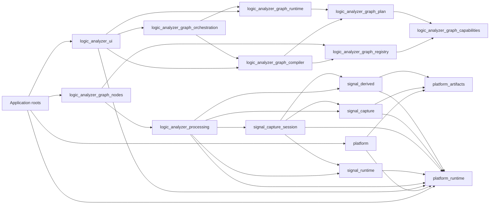
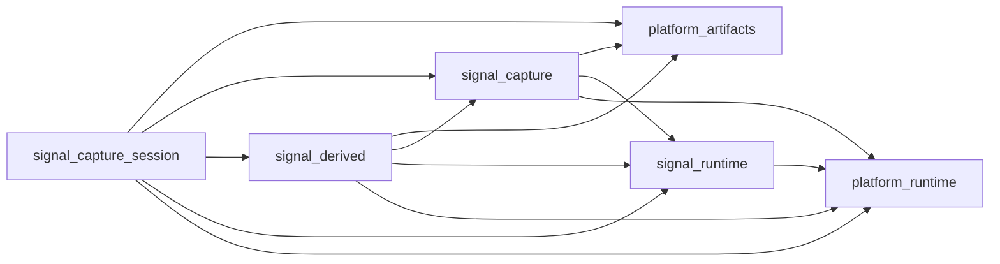

# Crate Responsibilities

## Purpose

This document is the workspace-level guide to crate ownership and dependency direction. Each crate
has one primary responsibility and an explicit boundary. The crate-specific designs and Rustdoc
facades provide detailed contracts; the cross-cutting designs in `docs/aspects/` define rules that
intentionally involve several owners.

Terms such as *graph document*, *lowering*, *processing graph*, *graph run*, *payload*, *capture*,
and *derived lane* have the meanings defined in
[Vocabulary and Concepts](vocabulary_and_concepts.md). The distributed runtime behavior is shown
in [Processing Graph Workflows](processing_workflows.md).

## Crate guide

### Generic platform, signal, and data-plane crates

#### `platform-artifacts`

Owns platform-neutral immutable byte regions, artifact and source identities, repository contracts,
in-memory repository behavior, replication, checksums, and persistence time primitives. Physical
filesystem or browser storage is supplied through the repository contract. Capture formats,
derived encodings, execution, and host selection remain outside this crate.

#### `platform-runtime`

Owns platform-neutral work execution and worker-operation contracts, serializable request and
result envelopes, registered finite-operation kernels, explicit inline/cooperative fallbacks, and
the target-independent bounded worker queue. It does not own stream graphs, process nodes,
application policy, or native/browser transports.

#### `signal-runtime`

Owns generic typed-stream execution: process-node lifecycle, named ports, channels, pipeline
wiring, scheduling, and threaded and cooperative managers. Its crate root is the supported
execution facade. It consumes injected `platform-runtime` work capabilities and does not define
their host adapters, capture or derived payload storage, acquisition sessions, concrete nodes,
graph documents, or presentation.

#### `signal-capture`

Owns generic immutable capture payloads, capture data-source and query contracts, random-access
signal capabilities, transition queries, and finite waveform indexing. Its crate root is the
immutable-capture facade. Acquisition lifecycle, concrete formats and devices, derived data, and
widgets remain outside this crate.

#### `signal-derived`

Owns presentation-neutral retained outputs: generic derived payloads, payload adapters, collection,
lane catalogs, bounded queries, sampling-point stores, indexes, and encoded derived storage.

Its public `derived_word_store` module owns the indexed annotation format, append and query
contracts, persistent publication, reopening, and storage administration shared by supported
timestamped payload adapters. Protocol decoding, renderer selection, and graph cache policy remain
outside that module.

#### `signal-capture-session`

Owns generic acquisition and recording lifecycles. Its public modules are domain facades:

- `live_capture` defines provider-neutral acquisition configuration, commands, events, progress,
  bounded delivery, and terminal outcomes;
- `live_capture_store` defines append-only recording, committed-prefix reading, finalization,
  recovery, and session-repository contracts; and
- `logic_analyzer` defines driver-neutral logic-analyzer configuration, trigger, source, and driver
  contracts.

Concrete device transports, formats, graph-node state, and UI workflow remain outside this crate.

#### `logic-analyzer-processing`

Owns concrete UI-independent processing behavior: capture formats and devices, processing sources,
protocol decoders, logic processors, and sinks. It implements the lower-level signal contracts and
translates format and transport failures at those boundaries.

The public `nodes` module groups supported executable components by role. Its `sources`, `decoders`,
`logic`, and `sinks` namespaces expose the configuration and factory contracts for each concrete
node family; their child modules own individual behaviors. The public `types` module contains
protocol-neutral conventions shared by those nodes, currently bit order, chip-select polarity, and
endianness. Graph definitions, saved-node migration, socket presentation, and host selection remain
outside this crate.

### Graph crates

#### `logic-analyzer-graph-capabilities`

Owns contracts implemented by graph-node and payload features. The public `node` module contains
the capability traits for document semantics, runtime materialization, capture and live features,
timeline behavior, and presentation. The public `node_support` module contains their neutral values
and restricted build services, including port kinds, resolved inputs, capture identities, and
presentation descriptors. Inventory assembly, lowering, built-in behavior, and host paths remain
outside this crate.

#### `logic-analyzer-graph-registry`

Owns graph-node, payload, and protocol-presentation registration descriptors; compile-time
inventory collection; deterministic validation; instance-owned editor registration overrides;
runtime capability overrides; and immutable `GraphRegistry` snapshots. Viewer-renderer registration
remains with `logic-analyzer-viewer`, and application-panel registration remains with
`logic-analyzer-ui`. The registry owns no graph document, lowering policy, execution lifetime, or
UI state.

#### `logic-analyzer-graph-nodes`

Owns the enabled built-in graph feature bundle: concrete node definitions, serialized state,
migrations, capability implementations, runtime builders, payload registrations, socket styling,
and presentation metadata. It contributes these features through registry contracts so generic
compiler, runtime, viewer, and editor code remain independent of concrete nodes and protocols.

#### `logic-analyzer-graph-plan`

Owns the neutral immutable boundary between graph planning and execution. `ProcessingGraph` carries
resolved runtime nodes and edges, materializer handles, payload materialization, output
subscriptions, source lifecycle, cache identity, and sampling metadata. The crate owns neither the
editable document nor an execution lifetime.

#### `logic-analyzer-graph-compiler`

Owns graph-document semantic analysis, discovery, validation, capability negotiation, diagnostics,
and lowering into `ProcessingGraph`. `GraphLowerer` reads an immutable registry snapshot and an
explicit output-subscription plan. The crate owns no repository, executor, active run, UI state,
concrete node behavior, or target selection.

#### `logic-analyzer-graph-runtime`

Owns source preparation, cache execution planning, processing-graph materialization, generated
collector materialization, graph-run lifecycle, progress and diagnostics, and live plan
reconciliation. It consumes a complete `ProcessingGraph` and injected repository, executor, and
runtime-manager services. It has no compiler, registry, editable-document, concrete-node, UI, or
target dependency.

#### `logic-analyzer-graph-orchestration`

Owns the application-neutral worker protocol, codecs, client lifecycle, and worker-side composition
of graph lowering and execution. It transports graph requests and run observations without making
the compiler or runtime own worker policy. Graph semantics and plan contracts remain with their
respective crates.

### Reusable document, widget, and application crates

#### `node-graph`

Owns the generic graph document model, definition registry, persistence reconciliation, editor
interaction, and egui graph widget. Its public `api` module is the compiler- and plug-in-facing
namespace for graph state, node and socket definitions, controls, panel actions, and the portable
file-dialog contract. The crate-root facade owns editor composition. Concrete node semantics,
compiler policy, and host adapters remain outside this crate.

#### `logic-analyzer-viewer`

Owns generic waveform and derived-lane presentation, viewport interaction, row organization,
cursor and edge measurements, visible-window sampling, sampling overlays, and renderer
registrations. It consumes explicit renderer keys and presentation metadata and never infers
protocol behavior from names or values. Source preparation, collection, and execution remain with
their owners.

#### `panel-layout`

Owns a reusable egui panel layout: its persistent tree, split placement, content selection,
dragging, closing, maximizing, and boundary menus. Panel and content identifiers are opaque;
application panel identity and behavior belong to the host.

#### `trigger-editor`

Owns the generic schema-driven editor for provider-neutral trigger programs. It renders trigger
contracts and emits edits without defining device predicate semantics, acquisition behavior, or
application workflow.

#### `widget-support`

Owns small application-neutral presentation helpers shared by reusable egui widgets. It does not
select concrete nodes, protocols, application commands, or menu policy.

#### `input-bindings`

Owns portable input-binding configuration, lookup, and shortcut presentation. Context and action
identities are opaque strings; application command policy and menu layout remain with the UI.

#### `logic-analyzer-ui`

Owns portable application interaction and panel composition. It coordinates the graph editor,
viewer, output selection, Run and live-apply workflow, documents, menus, panels, and application
services through UI-owned graph, host, and capture ports and the capture-export-owned service
contract. Concrete graph-node definitions, processing execution policy, host I/O, and target
selection remain outside this crate.

### Host, application, and support crates

#### `platform`

Owns reusable native and web host mechanisms and the workspace's single reusable target-selection
point. Its crate-root facade provides individually scoped storage, worker, random-access file,
output-file, document-dialog, and generic USB mechanisms to application composition. It has no
dependency on Logic Conduit domain crates. UI host adaptation, concrete formats and devices, graph
construction, and application policy remain outside this crate.

#### `logic-analyzer-capture-export`

Owns native streaming export of finalized generic captures, including format selection, progress,
observer, result, and stateful application-service contracts, plus the asynchronous native service
implementation. It does not own capture acquisition, graph behavior, concrete processing nodes,
or UI policy.

#### `logic-analyzer-app-native`

Is the native composition root. It boots the desktop host, enables the selected registration
inventory, adapts native host mechanisms to UI/domain ports, binds concrete node metadata and
runtime capabilities as instance-owned overrides, constructs `AppServices`, and injects them into
`logic-analyzer-ui`. Reusable application policy and services remain in library crates.

#### `logic-analyzer-app-web`

Is the browser composition root. It boots the web host, enables the selected registration
inventory, adapts browser host mechanisms to UI/domain ports, selects concrete node capabilities,
constructs both UI services and the worker graph runtime, and injects them. Reusable application
policy and services remain in library crates.

#### `logic-analyzer-test-support`

Owns deterministic providers, fixtures, and conformance helpers shared by cross-crate integration
tests. It contains no production composition or concrete UI policy.

#### `example-plugin`

Is the reference implementation of the supported compile-time plug-in surface. It contributes
externally owned graph nodes, runtime behavior, payloads, viewer presentation, and an application
panel without creating dependencies from generic host infrastructure back to the plug-in.

#### `logic-analyzer-examples`

Is the top-level integration package. It owns workspace-spanning integration and architecture
tests, graph examples, benchmarks, and the standalone CCD framebuffer example. Production
composition and reusable behavior remain in their owning crates.

## Dependency direction

The workspace dependency graph is acyclic. The diagram highlights the principal graph and
data-plane direction rather than every manifest edge. An arrow means "depends on"; compile-time
inventory consumption does not create a Rust dependency from a generic compiler or UI consumer to
a built-in node bundle.

`logic-analyzer-graph-compiler` and `logic-analyzer-graph-runtime` are peer consumers of the
neutral `logic-analyzer-graph-plan` contract and do not depend on each other. The compiler embeds
resolved materializer handles and payload behavior while lowering; the runtime consumes the
completed plan. `logic-analyzer-graph-orchestration` depends on both because its worker owns the
composition that invokes them in order.

The built-in node bundle and third-party plug-ins submit registry-owned descriptors containing
graph capabilities without depending on the compiler or runtime. A plug-in depends only on the
lower-level domains it uses. Graph features use capabilities and registry contracts; presentation
or application-panel contributions additionally use the corresponding viewer or UI extension
contract.

## Graph planning and execution

### Document analysis and plan production

The compiler transforms a `node_graph::api::GraphState` and an explicit output-subscription plan
into a deterministic neutral `ProcessingGraph` or semantic diagnostics. It owns:

- read-only access to graph and payload capabilities through a registry snapshot;
- graph traversal, pruning, socket, port, and semantic-contract validation;
- kind negotiation, edge resolution, topological validation, and stable runtime identities;
- document-semantic discovery and node-owned edits that do not start work; and
- compiler diagnostics associated with stable graph identities.

`GraphLowerer` is a stateless facade over an immutable `GraphRegistry`. Lowering does not retain an
artifact repository, allocate a runtime manager, prepare a source, or create an active run.

### Plan materialization and run lifecycle

The graph runtime owns operations with a preparation or execution lifetime:

- materializing plan nodes through compiler-resolved materializer handles;
- materializing generated collectors and configuring generic payload collection;
- validating cache entries and planning cache maintenance;
- preparing finite sources and reporting readiness;
- owning `GraphRun`, run data, progress, diagnostics, stop, wait, and live reconciliation; and
- substituting source processes for replay and live analysis.

The runtime receives `signal_runtime::AppManagerFactory`, `platform_runtime::WorkExecutor`, and
`platform_artifacts::ArtifactRepository` from composition.
It does not inspect the compilation target or directly create host paths, dialogs, USB transports,
browser objects, native threads, or web workers. `signal_runtime::AppManager` remains the generic
process-node executor.

### Application coordination

The UI's private graph-service adapter owns a lowerer and a graph runtime. It lowers the current
document before Run or apply and passes the resulting `ProcessingGraph` to the runtime. The
platform adapter provides worker transport, application composition injects its client into the UI
graph service, and the web app constructs the worker-side runtime. The neutral graph orchestration
crate owns the messages, codec, client, and worker-side compiler/runtime composition.

## Graph plug-in contracts

Graph-node registration exposes independent optional capabilities so each consumer receives only
the behavior it owns:

| Contract | Consumer | Responsibility |
| --- | --- | --- |
| `GraphNodeSemantics` | Compiler | Port kinds, semantic connection contracts, requiredness, and stable plan projection |
| `RuntimeMaterializer` | Compiler into plan; runtime from plan | Process-node construction, runtime configuration, and restart classification |
| `CaptureSourceFeature` | Compiler discovery | Capture identity, presentation description, and preparation factory |
| `LiveCaptureFeatureProvider` | Compiler discovery and UI service | Acquisition configuration, trigger features, and node-owned edits |
| `GraphNodePresentation` | Compiler and UI binding | Renderer keys, lane and table descriptors, sampling metadata, and panel metadata |
| `TimelineFeature` | Compiler discovery and UI service | Timeline markers, references, and node-owned edits |

The compiler copies resolved materializer handles and presentation values into the neutral plan.
The runtime invokes those handles through the plan and does not read the registry.

`NodeCatalogService` is a UI-owned portable port. Its snapshots contain stable namespaces,
host-formatted directory labels, scan status, diagnostics, and completed node templates. Native
application composition adapts the injected Sigrok scanner and work executor to that port; host
paths do not enter graph capability contracts or UI state.

## Generic processing dependencies

The generic data-plane crates have one-way dependencies and no umbrella facade:

Runtime payload negotiation uses generic type, stream-semantics, capacity, and capability
contracts. Architecture tests enforce the dependency direction and prevent one owner from
redirecting another owner's symbols through its crate root.

## Module rules

Every substantial owner module answers four questions in its module documentation:

1. What data and invariants does it own?
2. Which public or `pub(crate)` facade is its supported API?
3. Which adjacent owner modules may it depend on?
4. Which concerns are explicitly outside its boundary?

Leaf files implement one cohesive part of their owner and sibling leaves import each other
directly. Crate roots and directory-backed `mod.rs` files are curated facades, not alternate flat
module systems. A facade re-exports only its supported contract and the cross-domain values needed
to use it. The normative visibility and public-module rules are in
[Responsibility and Visibility Design](../aspects/responsibility_visibility.md).

## Documentation set

- `docs/architecture/` contains this crate guide, shared vocabulary, graph and application
  composition, and dynamic processing workflows.
- `docs/aspects/` contains rules that intentionally span owners: responsibility and visibility,
  native/web storage, live capture and trigger control, plug-in payload and presentation contracts,
  and testing.
- `docs/crates/` contains present-tense owner narratives where a relationship or internal domain
  needs more explanation than the public facade provides.
- Public crates and allowlisted public modules document their supported contracts in Rustdoc at the
  owning facade.
- `docs/integrations/` contains external protocol and decoder-host contracts;
  `docs/references/` contains hardware reference material.
- `docs/INDEX.md` is the documentation entry point. Actionable work belongs in `TODO.md`.

## Architectural acceptance criteria

- Lowering a document neither allocates runtime storage nor starts source preparation or a graph.
- Starting a graph consumes a `ProcessingGraph` and performs no document-semantic rewrite.
- `logic-analyzer-graph-compiler` has no graph-runtime dependency, repository, executor, or active
  run field.
- `logic-analyzer-graph-runtime` has no compiler, registry, editable graph document, widget,
  concrete node or protocol, path, or target dependency.
- `logic-analyzer-graph-capabilities` contains no inventory assembly, filesystem path, dialog,
  lowering, execution, or target-specific contract.
- `logic-analyzer-graph-registry` contains no graph document, lowering, execution lifecycle, UI,
  concrete node, or target dependency.
- A graph plug-in depends on graph capabilities, graph registry, and the lower-level contracts used
  by its behavior; optional presentation uses viewer or UI extension facades explicitly.
- Artifact, runtime, capture, derived, and capture-session owners have only documented downward
  dependencies and do not redirect each other's symbols.
- Every public module has one documented owner and a directory-backed facade.
