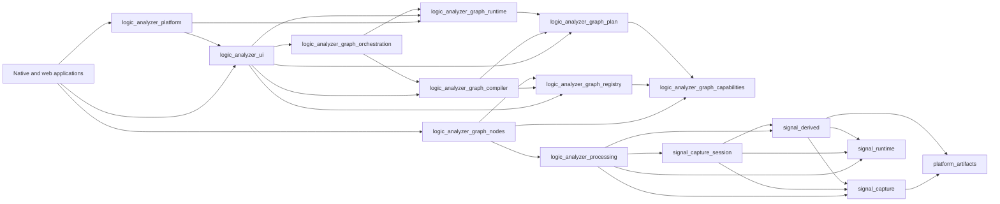

# Graph Composition Design

## Purpose

The graph subsystem separates an editable document, extensible node contracts, a deterministic
processing plan, and work with an execution lifetime. This separation keeps generic compiler and
runtime infrastructure independent of built-in nodes and protocols.

The dynamic paths are documented in
[Processing Graph Workflows](processing_workflows.md).
Shared architectural terms and identities are defined in
[Vocabulary and Concepts](vocabulary_and_concepts.md).

## Ownership

| Owner | Responsibility |
| --- | --- |
| `node_graph` | Editable graph document, stable node/socket identities, persistence reconciliation, and the generic editor |
| `logic_analyzer_graph_capabilities` | Traits and neutral values implemented by graph-node and payload features |
| `logic_analyzer_graph_registry` | Registration descriptors, inventory collection, validation, host overrides, and immutable capability snapshots |
| `logic_analyzer_graph_nodes` | Built-in node definitions, state, migrations, capabilities, payloads, and presentation registrations |
| `logic_analyzer_graph_compiler` | Document discovery, validation, capability negotiation, and lowering |
| `logic_analyzer_graph_plan` | Immutable `ProcessingGraph` contract shared by plan producers and consumers |
| `logic_analyzer_graph_runtime` | Cache planning, materialization, source preparation, execution, and active-run reconciliation |
| `logic_analyzer_graph_orchestration` | Worker protocol and worker-side composition above a separate lowerer and runtime |
| `logic_analyzer_ui` | Output selection, document interaction, Run/apply orchestration, and binding run data to presentations |

The dependency direction is acyclic. An arrow means "depends on"; inventory linkage does not add
a Rust dependency from a generic consumer to the built-in node bundle.

The compiler and runtime both depend on `logic_analyzer_graph_plan`; they do not depend on each
other. The runtime has no registry or editable-document dependency. The UI-owned graph-service
adapter and the worker runtime are the composition points that call a lowerer and then pass its
result to a separate runtime.

## Registration and immutable capability snapshots

Each enabled node bundle or plug-in submits registry-owned descriptors through `inventory` and
exposes an idempotent linker anchor. Application composition calls every enabled anchor before the
first inventory read. The registry validates submissions in stable-ID order and rejects duplicate
identities, duplicate definition names or payload types, unresolved required payloads, incomplete
semantic/materializer pairs, and unresolved host overrides.

`GraphNodeRegistration` keeps independent optional capabilities rather than presenting one broad
builder interface:

| Contract | Use |
| --- | --- |
| `GraphNodeSemantics` | Compiler-facing port kinds, connection contracts, required inputs, execution-state projection, source/sink classification, and runtime port names |
| `RuntimeMaterializer` | Runtime construction and restart/hot-configuration behavior; the compiler places its handle in the processing plan |
| `CaptureSourceFeature` | Capture identity, pre-run presentation, and source-preparation factory discovery |
| `LiveCaptureFeatureProvider` | Live-source discovery, acquisition configuration, trigger features, and node-owned edits |
| `GraphNodePresentation` | Protocol-neutral lane, table, sampling-overlay, and source-channel metadata resolved during lowering |
| `TimelineFeature` | Timeline-marker discovery, references, and node-owned edits |

Capabilities are separate contracts rather than one object serving every consumer, so a node that
participates in editing, lowering, and execution registers each role independently. A timeline
marker source, for example, registers timeline editing, document semantics, and runtime
materialization as three distinct contracts, and each consumer sees only the one it owns.

### Host capability overrides

A host override replaces individual capability fields of the registration with a matching stable
ID; it does not replace the registration. `GraphNodeCapabilityOverride` carries an optional value
per capability, and snapshot construction rejects an override whose stable ID matches no
registration.

Host backends override only `RuntimeMaterializer`. Document semantics, port kinds, presentation,
serialized state, and migrations stay with the generic registration, so a saved graph carries no
host-specific meaning: the same document opens on native and web, and only its execution differs.
The Sigrok decoder is the reference case — the native host supplies a materializer backed by the
Python decoder host, while an unavailable backend leaves the same node definition intact and
reports a runtime error rather than changing what the document means.

`PayloadRegistration` associates a stable payload identity and runtime `PortKind` with a type-erased
ingestion adapter, default lane presentation, request customization, and persistent-cache support.
`ProtocolPacketPresentationRegistration` associates protocol packet identities with display
functions. The registry owns both inventories; capability crates contain only the contracts and
values carried by them.

The compiler owns an immutable `GraphRegistry` snapshot. The UI constructs the editor's
`NodeTypeRegistry` from the same validated registration inventory, but it does not ask the
compiler to build the editor catalog. Built-in nodes and plug-ins do not depend on the compiler.
Plug-ins that contribute viewer renderers or application panels use the explicit viewer and UI
extension facades.

## Processing-plan boundary

`GraphLowerer` retains an immutable registry snapshot and the application-supplied
`OutputSubscriptionPlan`. Lowering produces a `ProcessingGraph` containing:

- canonical node state and stable runtime names;
- compiler-resolved materializer handles and execution-state projections;
- concrete runtime edges, port names, negotiated payload kinds, and buffer sizes;
- source lifecycle and stable/dynamic capture-cache identity;
- retained-output and decoder-table subscription metadata;
- resolved sampling-overlay candidates;
- derived-data retention policy; and
- a neutral `ProcessingPayloadCatalog` used to materialize generated collectors.

The plan is complete enough for `GraphRuntime` to materialize and run it without querying a
registry, inspecting a graph document, importing the compiler, or branching on concrete node and
protocol names. Runtime results are published through `RunData`, which groups retained
`DerivedLanes`, resolved output and table subscriptions, sampling candidates, diagnostics, and
source readiness.

## Output selection and presentation

Viewer selection is application state. The UI persists stable source node/output identities in
the `logic_analyzer_graph.viewer_selections` extension and converts the selected endpoints to an
`OutputSubscriptionPlan` before discovery, lowering, cache inspection, or Run. The compiler uses
that plan to add generic output-subscription collectors; it does not construct Viewer nodes or
read widget state.

Producer presentation capabilities contribute neutral grouping, ordering, badge, display-format,
table-column, sampling, and renderer-key metadata. The compiler resolves that metadata against
the graph and transports it in the plan. The runtime transports it with collected lanes. The UI
resolves renderer keys through viewer registries and creates waveform or table presentations.
Missing renderers are UI binding errors, not compiler or runtime special cases.

The UI retains its presentation catalog separately from run-owned lane storage. Graph edits can
therefore hide, restore, or reformat a presentation without deleting retained data or rerunning a
decoder. Retention and visibility are independent: hiding a lane or sampling overlay changes only
the UI projection.

## Saved-document compatibility

Stable graph-node IDs, payload IDs, definition names, serialized node state, and namespaced graph
extensions are persisted contracts. Each concrete node owns decoding and migration of its state
and reports user-visible warnings when a saved form is transformed or cannot be restored.

A renamed node keeps its former definition name as a saved alias owned by the node itself, so
documents written before the rename still resolve. `Parallel Decoder` retains the `Binary Decoder`
alias this way, and the alias reports a user-visible warning naming its replacement. Generic
registry, compiler, and viewer code performs no name-based inference; only the owning node knows
its own history.

At the UI document boundary, persisted Viewer nodes and socket-level `show_in_view` state are
accepted as compatibility inputs and converted to `logic_analyzer_graph.viewer_selections`.
Viewer-input payload identities are reconciled to their producer outputs, obsolete Viewer nodes
are removed, and unavailable plug-in payload identities remain preserved in
`logic_analyzer_graph.payload_subscriptions`. Generic viewer, registry, and runtime code performs
no name-based compatibility inference.

## Enforcement

Architecture checks enforce these boundaries:

- capabilities own contracts but no inventories, paths, dialogs, lowering, execution, or UI state;
- the registry owns inventories but no graph documents, generated collectors, execution lifetime,
  concrete nodes, UI, or target selection;
- the compiler owns no runtime service, repository, executor, active run, widget, or concrete node;
- the runtime owns no compiler, registry, editable graph document, widget, or concrete protocol;
- built-in nodes and plug-ins do not depend on the compiler;
- the UI does not import concrete processing nodes; and
- native/web selection is confined to application bootstrap and `logic_analyzer_platform`.
