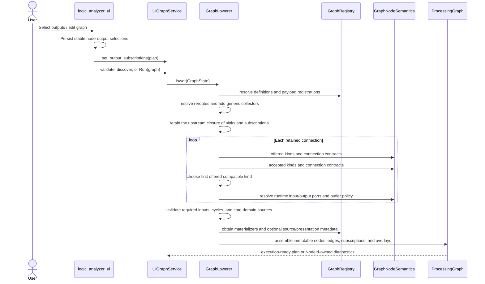
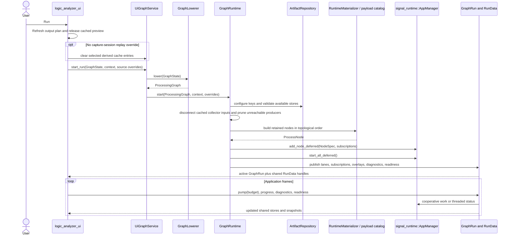
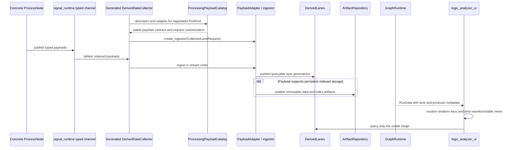
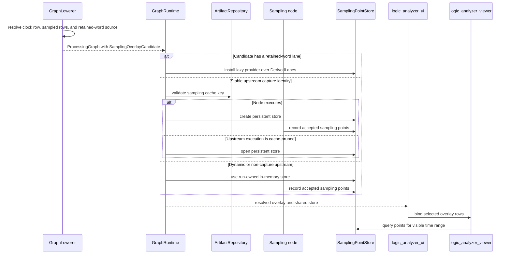

# Processing Graph Workflows

This document describes the runtime behavior that is distributed across graph registration,
lowering, execution, derived-data storage, and presentation. All workflows use generic capability
contracts; concrete nodes and payload plug-ins supply behavior without adding name-based cases to
the compiler, runtime, UI, or viewer.

The terms used in these sequences are defined in
[Vocabulary and Concepts](vocabulary_and_concepts.md).

## Building the processing graph

Before lowering, the UI converts its selected graph endpoints to an `OutputSubscriptionPlan`.
`GraphLowerer` then analyzes the editable document against one immutable `GraphRegistry` snapshot.
It does not allocate stores, prepare a source, create an execution manager, or start work.



### Capability negotiation

Negotiation occurs per connection rather than per editor socket. The producer supplies an ordered
set of `PortKind`s and the consumer supplies the kinds it accepts. The first kind in the
producer's preference order that the consumer accepts wins. When both sides declare semantic
connection-contract identities, those sets must also overlap. The compiler then asks both sides
for the runtime port names for that selected kind.

Generated collectors accept only payload kinds with a `PayloadRegistration`. This ensures the
processing plan carries a type-erased ingestion adapter and a stable payload identity before the
runtime sees the plan. Compiler errors retain the owning `NodeId`, allowing the editor to badge the
node without interpreting diagnostic text.

Sampling and presentation discovery are also capability driven. `GraphNodePresentation` describes
which node inputs are the clock and sampled groups, which output supplies an optional retained-word
source, and which generic lane/table descriptors apply. The lowerer resolves those descriptions to
capture-row and producer-output identities and stores only the resolved values in the plan.

## Starting and running a pipeline

The UI's concrete `UiGraphService` owns a lowerer and a separate runtime. Pressing Run uses them in
sequence. A file/synthetic UI Run releases passive preview handles and clears the selected graph's
derived cache entries so Run means fresh execution. Re-analysis uses a dynamic capture-session
source and fresh derived stores. Other runtime clients can keep validated cache entries and allow
execution pruning.



All initial subscriptions are installed before the manager starts any node. This matters for
self-threading sources, which snapshot their subscribers when work begins. Native composition
injects a threaded manager; web composition injects a cooperative manager. The graph runtime uses
the same materialization and lifecycle contract for both.

When worker execution is selected, `logic_analyzer_graph_orchestration` transports the request to
a worker-owned composition. The worker calls its own `GraphLowerer`, passes the resulting plan to
its own `GraphRuntime`, and returns run messages. This preserves the same compiler/runtime boundary
without requiring the plan's in-process trait handles to cross the worker transport.

## Collecting derived data

Retention is represented by compiler-generated collector nodes. A collector has no concrete
payload branches: its plan-owned payload catalog selects the registered adapter for each negotiated
kind and builds a type-erased ingestor.



`signal_derived` owns retained payloads, ingestion, indexes, sampling stores, and artifact formats.
`logic_analyzer_graph_runtime` owns when stores are configured and attached to a run.
`logic_analyzer_ui` owns which retained data is visible and how neutral renderer keys become
widgets. Presentation changes never alter collection policy.

## Derived-cache and sampling-point behavior

Persistent keys are protocol neutral. For a derived lane, the runtime hashes the cache ABI and
package version, collector state and member, selected port and payload kind, and a canonical hash
of the complete upstream graph. Each upstream node contributes its definition identity, canonical
state, incoming edges, and capture identity. A dynamic capture identity makes the result
non-persistent; a stable capture identity makes equivalent plans reusable.

Sampling overlays use either an existing retained-word lane as a lazy point provider or a dedicated
`SamplingPointStore`. Dedicated persistent stores use the same upstream identity rules as derived
lanes. Visibility is not part of either key.



Opening a document uses `GraphRuntime::load_cached_data`: it validates derived stores, opens any
matching sampling stores, materializes only collector adapters needed to expose cached lanes, and
does not start producers or sinks. This passive preview is replaced when the user presses Run.

During live graph reconciliation, sampling stores are reused by stable graph `NodeId` before the
runtime diffs the old and new plans. Presentation-only edits therefore retain accumulated sampling
decisions. A run that pruned producers because of persistent cache hits requires a full restart for
structural edits, because the absent producer path cannot be safely reconciled in place.

Cache maintenance is best effort and correctness neutral. Only a validated hit disconnects a
collector input. A missing, corrupt, or unreadable entry leaves the producer connected so data is
regenerated. Cleanup receives the active keys as pins and cannot change the meaning of a run.

## Live graph reconciliation

The UI compares semantic graph snapshots, excluding editor layout and other presentation-only
state. A valid changed snapshot is lowered to another complete `ProcessingGraph`; the active run
then classifies the plan difference.

```mermaid
sequenceDiagram
    participant UI as logic_analyzer_ui
    participant Lowerer as GraphLowerer
    participant Run as LiveRun
    participant Manager as signal_runtime::AppManager

    UI->>UI: detect semantic document change
    UI->>Lowerer: lower(edited GraphState)
    alt Document is invalid while editing
        Lowerer-->>UI: diagnostics
        UI->>Run: leave active plan unchanged
    else Valid replacement plan
        Lowerer-->>UI: ProcessingGraph
        UI->>Run: apply_processing_graph(plan)
        Run->>Run: reuse sampling stores and diff by NodeId
        alt Hot configuration
            Run->>Manager: reconfigure node
        else Added or removed branch
            Run->>Manager: add or remove affected nodes
        else Restartable state or wiring change
            Run->>Manager: restart affected node
        else Source change or cache-pruned topology
            Run-->>UI: NeedsFullRestart; active run remains available
        end
    end
```

Configuration epochs use the same lowering path but accept only materializer-declared hot
configuration. The run schedules those changes at the supplied sample/time boundary; structural,
source, and acquisition changes remain in the editable document and are reported as deferred.
