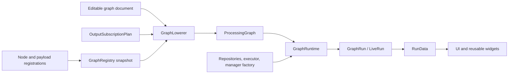

# Vocabulary and Concepts

This document defines the terms used across the LogicConduit architecture. The definitions are
about ownership and behavior, not about a particular user interface or processing protocol.

## System model

The editable document describes user intent. Registrations describe the available graph features
and payload behavior. Lowering resolves both into a complete, immutable processing plan. The graph
runtime materializes that plan using injected execution and storage services. A run publishes
generic observations that the application binds to presentation components.

## Tier vocabulary

The `platform`/`platform_*` and `signal_*` names identify reusable, application-neutral
infrastructure.
Within the signal tier, domain-neutral signal concepts include samples, edges, typed streams,
immutable captures, retained values, and acquisition lifecycle. Logic-analyzer graph concepts,
concrete devices and formats, decoded protocols, renderer contracts, and product-specific trigger
or control vocabulary belong to `logic_analyzer_*` owners above that tier.

A new type lives in the lowest crate whose stated responsibility covers its behavior. A
domain-specific type is not moved into the signal tier merely because it might be reusable later;
when multiple domains need a capability, they share an explicitly neutral contract owned by the
corresponding signal crate. The existing `signal_*` crate names accurately express this boundary,
so this ownership decision does not require a crate rename.

### Proposed future separation

The remaining `signal_capture_session::logic_analyzer` facade and trigger- or protocol-specific
retained-data contracts are relocated to logic-analyzer domain owners. The actionable relocations
are tracked by `session.domain-relocation` and `derived.payload.builtin-registration` in
[`TODO.md`](../../TODO.md).

## Graph documents and features

### Graph document

A graph document is the editable, serializable `node_graph_document::GraphState`. It contains graph-node
instances, their state, connections, frames, and namespaced extensions. It does not contain runtime
threads, repositories, prepared sources, or active processing nodes.

### Graph-node definition and graph-node instance

A **graph-node definition** is the static `NodeDef` contract for one kind of editor node. It creates
and interprets that node's serialized state and declares its sockets and controls.

A **graph-node instance** is one node in a graph document. Its `NodeId` identifies the instance
across lowering, diagnostics, live reconciliation, and presentation binding. The definition name
identifies the node kind; the display title is presentation and is not an architectural identity.

### Graph feature

A graph feature is behavior contributed by a built-in node bundle or plug-in. Its registration may
provide independent capabilities for document semantics, runtime materialization, capture-source
discovery, live capture, timeline editing, and presentation. Generic consumers use those
capabilities and never infer behavior from node names, socket labels, or protocol values.

### Registration and registry snapshot

A **registration** is a descriptor submitted by a node or payload owner. It associates stable
identities with capability implementations and metadata.

A **registry snapshot** is an immutable, validated `GraphRegistry` assembled from all enabled
registrations and host overrides. The compiler and UI read the snapshot. The graph runtime does not:
everything required for execution is copied or resolved into the processing graph during lowering.

### Capability

The word **capability** has two scoped uses:

- a **graph capability** is an optional contract implemented by a graph feature, such as
  `GraphNodeSemantics`, `RuntimeMaterializer`, or `GraphNodePresentation`;
- a **host capability** is a portable service contract implemented by a platform adapter, such as
  storage, file selection, worker transport, or USB access.

Both forms make optional behavior explicit. A capability is not selected by inspecting a display
name or compilation target inside a generic consumer.

### Saved-document synchronization

Saved-document synchronization reconciles persisted node state with the definitions available in
the current registry. The concrete graph-node feature owns state decoding and migration. The
document boundary preserves unavailable plug-in data where its contract permits and reports
user-visible compatibility warnings.

## Planning and execution

### Output subscription

An **output subscription** identifies a graph-node output whose values must be retained for a
waveform, table, or another application consumer. `OutputSubscriptionPlan` is the application-owned
set of those stable selections. Visibility and retention are different: hiding a presentation does
not delete already retained data.

### Lowering

**Lowering** is the deterministic analysis that transforms a graph document and an output
subscription plan into a `ProcessingGraph`. It resolves reroutes, prunes unreachable work,
negotiates connections, validates required inputs and cycles, embeds runtime materializers, and
adds generic collectors. Lowering performs no source preparation and starts no processing work.

### Capability negotiation

Capability negotiation selects a compatible runtime representation for each graph connection. A
producer offers an ordered set of `PortKind`s; the consumer declares the kinds it accepts. The
first compatible kind in producer preference order wins. When both sides declare semantic
connection contracts, the selected connection must satisfy those contracts as well.

### Processing graph

A **processing graph** is the immutable `logic_analyzer_graph_plan::ProcessingGraph` produced by
lowering. It contains stable runtime node identities, resolved materializers, concrete runtime port
names and edges, source lifecycle information, collection requests, presentation descriptors, and
cache identities. It is complete enough to execute without the editable document or registry.

### Runtime materialization

**Materialization** turns a processing-graph node into a `signal_runtime::ProcessNode`. A
`RuntimeMaterializer` is supplied by the concrete node feature and receives only the restricted
build context and resolved plan inputs. Generated collector nodes are materialized through the
plan's payload catalog.

### Graph runtime and run

`GraphRuntime` prepares sources, evaluates cache availability, materializes a processing graph, and
starts it through an injected runtime-manager factory. It owns resources whose lifetimes begin
while a plan is prepared or executed.

A **graph run** is the active lifecycle handle returned by the runtime. `GraphRun` exposes stop,
wait, progress, diagnostics, source readiness, and shared `RunData`. `LiveRun` additionally accepts
compatible replacement processing graphs and classifies edits as hot configuration, branch
changes, node restarts, or full-restart requirements.

### Configuration epoch

A **configuration epoch** applies materializer-declared hot configuration at a supplied time or
sample boundary. It changes supported runtime configuration without treating a structural graph or
source change as hot configuration.

### Execution manager

`signal_runtime::AppManager` owns typed-channel wiring and process-node execution. Native
composition supplies a threaded implementation; web composition supplies a cooperative
implementation. Graph runtime controls the lifecycle of one compiled plan but does not implement
the scheduler itself.

### Run data

`RunData` is the presentation-neutral observation surface of a run. It groups retained derived
lanes, resolved output and table subscriptions, sampling overlays, diagnostics, and source
readiness. The UI retains these handles and binds them to widgets without giving the widgets
ownership of execution or storage.

## Streams and retained data

### Process node and typed port

A **process node** is a UI-independent executable component managed by `signal_runtime`. It
receives and publishes values through named typed ports. Graph-node instances describe intent;
process nodes perform the resulting work.

`PortKind` is the runtime payload identity negotiated for a connection. A **semantic connection
contract** is an additional stable identity that expresses meaning not captured by the Rust payload
type alone. Socket labels and display names have no role in either identity.

### Payload and payload registration

A **payload** is a value transported through a typed runtime stream. A `PayloadRegistration`
associates its stable payload identity and `PortKind` with type-erased retained-data ingestion,
default presentation metadata, request customization, and optional persistent-cache behavior.
The compiler places the required registrations into a plan-owned `ProcessingPayloadCatalog`, which
lets generated collectors operate without concrete payload branches.

### Derived lane and collector

A **derived lane** is retained, queryable output produced during processing. It is presentation
neutral and may be backed by memory or indexed artifacts. `DerivedLanes` is the run-scoped catalog
of those lanes.

A **collector** is a compiler-generated process node that consumes a subscribed output. Its
payload adapter preserves values in the appropriate lane representation and publishes bounded
query handles for presentation consumers.

### Sampling overlay and sampling point

A **sampling overlay** relates a clock source, sampled signal rows, and accepted sampling times.
The compiler resolves the involved graph identities; the runtime supplies either a retained-word
provider or a `SamplingPointStore`; the viewer queries only the visible range. Sampling-point
storage is independent of whether the overlay is currently visible.

## Capture, artifacts, and caches

### Artifact and artifact repository

An **artifact** is an immutable byte region addressed by a stable artifact identity. An
`ArtifactRepository` provides platform-neutral publication, lookup, integrity, replication, and
administrative operations. Platform adapters choose the physical backing.

### Byte source and source identity

A **prepared byte source** provides read access to bytes that are already available to a consumer.
Its `SourceIdentity` describes whether equivalent content has a stable reusable identity. A byte
source is distinct from a graph capture-source feature and from an executable source process node.

### Capture and capture session

A **capture** is generic signal data with immutable payload and random-access query contracts.
Finite capture indexes answer waveform queries without owning acquisition.

A **capture session** owns acquisition lifecycle, bounded delivery, recording, committed-prefix
visibility, finalization, and replay. Concrete devices and file formats implement or consume these
generic contracts in their positive-responsibility domain crates.

### Derived cache identity and cache entry

A **derived cache identity** is a protocol-neutral hash of the collector contract and the complete
upstream processing identity, including stable source identity. A **cache entry** is the validated
set of artifacts published for that identity. Only a validated hit may prune producer work; a
missing or invalid entry causes normal regeneration.

### Source readiness

**Source readiness** is the runtime state of preparing data required by a processing source. It is
reported through a run so the application can present progress. It is not graph-document state and
does not affect lowering.

## Presentation and composition

### Presentation descriptor and renderer key

A **presentation descriptor** is generic metadata that tells the application how a retained output,
table, source channel, or sampling overlay can be presented. A stable **renderer key** selects a
registered renderer. The viewer and UI do not select rendering behavior from protocol or node names.

### Platform adapter and composition root

A **platform adapter** implements portable host capabilities with native or browser APIs.
`platform` is the reusable target-selection boundary.

A **composition root** is a native or web application package that selects an enabled plug-in
inventory, obtains low-level platform mechanisms, adapts domain and UI ports, selects concrete node
capabilities, and constructs application and worker services. It does not own reusable storage,
execution, graph, or presentation policy.

### Worker orchestration

**Worker orchestration** is the application-neutral message and transport protocol used when graph
work runs in a worker. The worker owns its own compiler and runtime composition and returns run
messages; in-process materializer handles do not cross the transport boundary.
