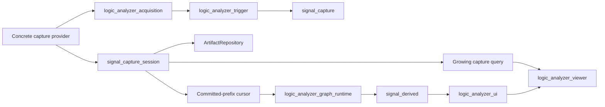
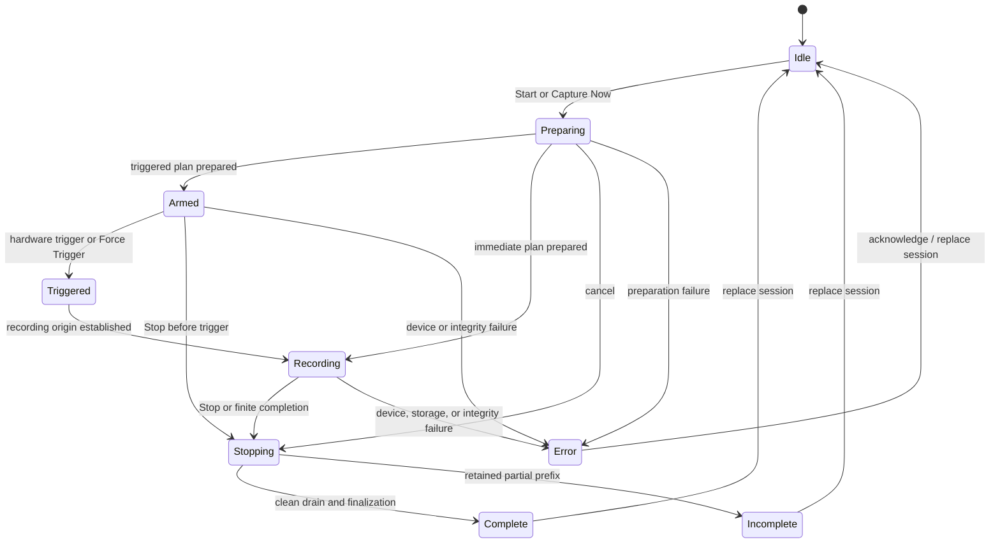
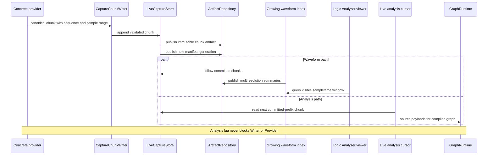
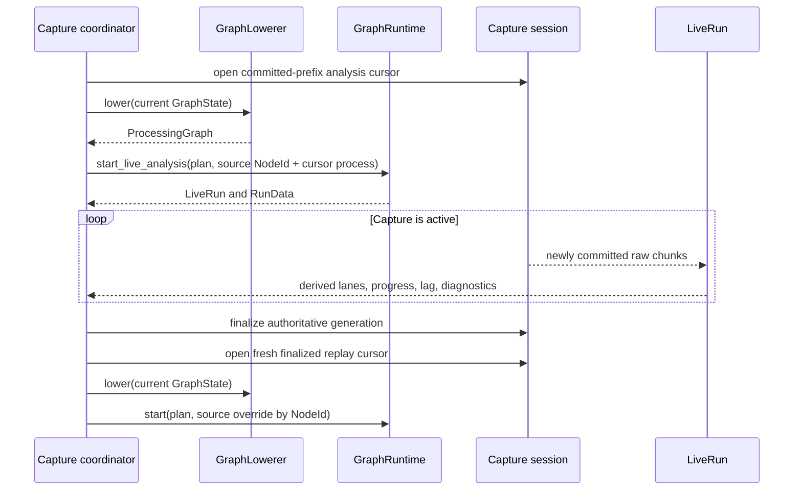

# Live Capture and Trigger Control

Live capture separates hardware acquisition from graph processing. Acquisition writes a canonical,
authoritative raw session as quickly as the provider supplies data. The viewer, growing waveform
index, and live analysis consume independent cursors over the committed prefix, so decoder
backpressure cannot stall the device reader or retain acquisition buffers.

The DSLogic U3Pro16 has native buffered and host-streamed profiles. Generic capture, graph, UI, and
viewer code uses opaque source capabilities and never branches on that device name, transport,
channel label, or mode label.

## Responsibilities

| Owner | Responsibility |
| --- | --- |
| `signal_capture` | Opaque physical-channel identity and immutable capture/index contracts |
| `signal_capture_session` | Driver-neutral lifecycle, capture policy, canonical session store, committed-prefix cursors, retention, and growing index contracts |
| `logic_analyzer_trigger` | Serializable trigger programs, capability schemas, simple conditions, and validation |
| `logic_analyzer_acquisition` | Device-neutral driver, capture configuration, hardware-trigger, raw-chunk, and runtime-source contracts |
| `logic_analyzer_device_dslogic` | DSLogic acquisition provider, device protocol, source factory, and packet conversion |
| `logic_analyzer_graph_nodes` | Concrete live-source graph definition, saved state, migration, capabilities, and presentation metadata |
| `logic_analyzer_graph_compiler` | Discovery of the one retained live source and lowering of its graph semantics |
| `logic_analyzer_graph_runtime` | Materialization of the compiled analysis/replay graph and explicit source-process substitution |
| `logic_analyzer_ui` | Capture coordinator, user commands, graph-service orchestration, run exclusion, and presentation binding |
| `logic_analyzer_viewer` | Generic growing-query rendering, navigation, trigger marker, and neutral per-lane trigger edit events |
| `platform` | Native USB, work execution, artifact repository, export destination, and whole-adapter target selection |

Inside `logic_analyzer_ui::live_capture`, `CaptureCoordinator` is the stable composition facade for
three private owners. `CaptureAcquisition` admits one active worker and serializes capture commands
and configuration-epoch acknowledgements. `CapturePublication` owns completed-session pins,
waveform publication and retirement, application metadata, replay construction, retention cleanup,
and export state. `CaptureStatusProjection` maps acquisition events and terminal outcomes to the
status consumed by application controls and records ordered state history. The coordinator itself
contains only transitions that couple these owners.

## Source discovery and capabilities

A concrete graph node registers a `LiveCaptureFeatureProvider`. Discovery first lowers the graph,
then considers only live features belonging to retained nodes. Start requires exactly one retained
live source. Zero or multiple candidates produce capability errors; generic code never chooses a
source by node name.

The state-bound `LiveCaptureFeature` describes:

- opaque session and physical `CaptureChannelId` identities;
- enabled channel identities, graph outputs, stable user labels, and presentation rows;
- device-buffered or host-streamed acquisition profiles;
- valid channel-count, sample-rate, depth, clock, encoding, and trigger combinations;
- whether partial buffered upload, Stop, Abort, Force Trigger, and Capture Now are supported;
- requested and effective capture policy and capacity; and
- a reusable graph-source factory with explicit runtime ports and timebase.

Capabilities are queried for the discovered device instance. Connection type, firmware, channel
banks, and selected profile may change the accepted combinations. The provider returns typed
capability values; the coordinator does not consume untyped property maps or infer behavior from
display strings.

`CaptureChannelId` is not an array index and need not be numeric or contiguous. The concrete
feature maps it to physical hardware and graph outputs. Viewer row order and labels are separate
presentation values.

## Trigger and capture policy

`TriggerProgram` is a neutral, serializable program owned by `logic_analyzer_trigger`. The standard
simple digital predicates are Ignore, Low, High, Rising, Falling, and Either. The U3Pro16 feature
maps enabled physical inputs to its hardware trigger stage and AND-combines non-ignored simple
conditions. Unsupported programs and impossible channel/rate/depth combinations fail validation
before the device is armed.

The generic `TriggerEditorSchema` describes predicates, operands, stages, limits, defaults, and
validation messages through stable registered IDs. The Triggers panel emits neutral edit
operations; the concrete node validates and rewrites its serialized state. Neither the panel nor
the viewer deserializes device state.

Capture policy composes:

- immediate or triggered start;
- finite completion or manual Stop;
- pre/post-trigger placement;
- trigger timeout with continue-waiting, clean Stop, or Force Trigger action; and
- retain-all, recent-duration, or recent-byte storage policy.

Capture Now starts one immediate session without modifying the saved trigger program. Force
Trigger is available only while Armed and only when the provider advertises it. Stop requests an
orderly drain and finalization. For buffered devices it requests partial upload when the negotiated
plan supports that operation; otherwise the UI reports before arming that Stop cannot retain data.
Abort is the immediate escape path and never labels a partial session Complete.

The negotiated `CaptureSessionPlan` records requested and effective settings, capacity, retention,
capture window, trigger placement, and hardware encoding. Acquisition and presentation therefore
share one exact timeline extent.

## Session lifecycle

Preparation freezes one validated provider plan before Start issues the final arm command.
Provider events publish lifecycle, acquisition phase, progress, health, negotiated plan, exact
trigger sample, and structured failure independently from data chunks.

The application exposes Idle, Preparing, Armed, Triggered, Recording, Stopping, Complete, and Error
as user-facing states. Device-buffered profiles additionally report on-device capture and upload
phases; host-streamed profiles report the growing committed duration. Stop is idempotent. Trigger
waiting and preparation are cancellable.

## Authoritative store and independent consumers

Providers commit versioned canonical chunks through `CaptureChunkWriter` and publish control events
through `CaptureEventPublisher`. Canonical chunks carry the physical-channel table, logical sample
range, initial levels, and packed samples or transition runs. They make no assumption about a
sixteen-channel maximum, contiguous numbering, byte-aligned transfers, or device interleave.

The U3Pro16 FPGA uses run-length encoding internally for capture memory and expands USB upload to
ordinary interleaved samples. The provider therefore stores the expanded canonical stream. Narrow
transfers retain a sub-sample carry across USB packets so incomplete samples are never committed.

Each chunk is published as a bounded artifact before the manifest advances. Readers observe only
the committed prefix. Finalization seals the same generation for replay; it does not copy the raw
capture into another representation.

A recording-origin gate keeps analysis pending while Armed. When the trigger is known, it clips the
chunk crossing the origin and presents live analysis and finalized replay as a zero-based stream.
The authoritative pre-trigger prefix remains intact, and the cursor exposes its capture-timeline
offset so derived timestamps align with the raw trigger marker.

The growing waveform index follows committed chunks and publishes bounded multiresolution summary
pages. Detailed views query exact raw data; wider views query summaries. Pause Display freezes the
viewer's observed generation while acquisition, indexing, and analysis continue. Follow Newest and
Go Live move only the viewport.

Retention uses explicit consumer pins and a monotonic safe-reclamation boundary. The store never
reclaims a chunk required by the device-independent replay cursor, analysis cursor, index worker,
viewer query, or save operation. A slow analysis cursor reports lag but does not apply acquisition
backpressure.

## Live analysis and replay Run

After acquisition starts, the coordinator opens an independent store cursor and supplies it as a
`LiveAnalysisSource` for the discovered source `NodeId`. The graph service lowers the current
document, and `GraphRuntime::start_live_analysis` replaces only that source process. All downstream
nodes use the same processing plan and port mapping as an ordinary Run.

Driver-neutral setting, capability, and analysis-source invariants are represented by
`CaptureValidationError`. A provider preserves that cause through
`AcquisitionError::InvalidRequest`; a graph feature preserves analysis-source construction causes
through `CaptureGraphSourceError`. Neither boundary depends on a concrete device or formats the
cause into a display string.

Application coordination retains repository, capture-store, graph-source, waveform-index,
executor, export, acquisition, capture-policy, and metadata-codec failures through
`CaptureCoordinatorError`. Worker completion, live attachment, finalized replay, retention, and
publication use that typed contract; status projection and toast/run-message presentation format
the final diagnostic.

Run and hardware capture exclude one another. A live-source graph requires its associated finalized
session for Run; Run does not reopen hardware. Each replay opens a fresh cursor, uses fresh derived
lane stores, and replaces live-derived presentation atomically. Raw capture data remains unchanged.

## Graph edits and configuration epochs

Acquisition settings are immutable from Preparing through finalization. The node editor remains
read-only during Preparing and Armed. During Recording it accepts document edits, but the active
analysis run applies only changes classified by the owning `RuntimeMaterializer` as hot
configuration.

Each attempted hot revision receives a monotonically increasing epoch ID and a boundary at the
durable raw sample frontier. The coordinator records the complete attempted graph, source and
recording-relative sample coordinates, effective timestamp, and a Pending outcome before the
runtime change is scheduled. The outcome becomes Applied, Deferred, or Failed. An unresolved
record recovered after interruption is Failed.

The processing node changes configuration immediately before its first event at or after the
boundary. Queued older events use the preceding configuration, and emitted words, markers, files,
and viewer lanes are not rewritten. Node additions/removals, wiring changes, restarts, source
changes, and acquisition changes stay in the editable graph and are reported as deferred to the
next capture or Run.

Re-analysis uses the current graph from the recording origin; it does not replay the live epoch
log.

## Session ownership, persistence, and export

The application owns one replaceable capture session. Starting another capture releases viewer,
analysis, replay, derived, index, and store handles and waits for capture-owned workers before
removing the preceding working repository. Raw session bytes are not graph-document state and
there is no session-history UI.

The graph document stores source and trigger configuration. It contains no temporary capture
reference. The internal session stores its opaque channel table, sample rate, names, actual trigger
sample, recording origin, retained start, logical sample count, encoded byte count, negotiated
plan, graph snapshot for immediate replay, configuration epochs, and outcome.

Save Capture Data pins a finalized session and streams it through
`logic_analyzer_capture_export` to a sigrok v2 `.sr` file. The export contains raw physical
channels, channel names, and sample rate. Trigger position uses an optional compatible metadata key
and produces a warning because sigrok v2 has no standard trigger-position field. Derived lanes are
not represented as raw capture data. Native application composition adapts destination selection
and injects the capture-export-owned asynchronous service; web composition injects the explicit
unavailable service.

## Integrity and failure rules

- Sequence gaps, short writes, device/link overflow, and store failures are integrity errors.
- Only fully published chunks belong to the committed prefix; recovery never accepts an
  uncommitted tail.
- Partial sessions retain an explicit Incomplete, Aborted, CancelledBeforeTrigger, or Corrupt
  outcome and are never presented as Complete.
- Force Trigger records the provider-acknowledged sample and is issued only through an advertised
  capability.
- The UI thread performs no USB, capture-store, index-build, or export I/O.
- Pausing the viewer does not pause acquisition or grow an unbounded UI queue.
- Capture replacement and cleanup wait for pins and background workers.
- Hardware and graph failures retain the valid committed prefix for explicit save or discard.

## Verification

Deterministic providers exercise the same contracts as U3Pro16 without USB hardware. One streams
non-contiguous bank-qualified channels; another buffers on-device, publishes only during upload,
uses a different setting matrix, and has no Force Trigger. Contract tests cover policy validation,
trigger placement, unaligned chunk boundaries, lifecycle commands, partial upload, retention,
recovery, index/query equivalence, analysis lag, configuration epochs, replay substitution, and
save pinning. Hardware protocol and throughput tests remain explicitly ignored unless the device
is attached.
