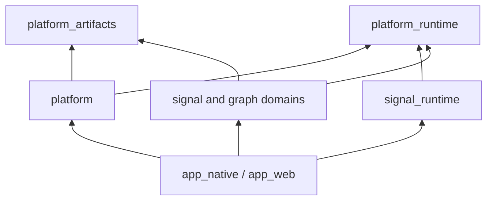

# Unified Native and Web Storage Platform Design

## Architecture

Raw-capture storage, finite and growing waveform indexes, finalized replay, decoded-word storage,
viewer lanes, graph-plan data models, concrete graph-node definitions, and source/sink factory
contracts are platform-neutral. These facilities use repository-backed stores on every target and
contain no filesystem operations or target-selected source.

The injected artifact repository selects only the byte backing. Native composition supplies a
durable adapter whose immutable reads are mmap-backed. Web composition opens an OPFS-backed browser
repository whose synchronous bounded-memory mirror is the hot path; when OPFS initialization
fails, it injects the process-lifetime memory repository. Ranges without stable contiguous storage
use an owned immutable-region fallback. Every repository publishes immutable generations
atomically through the same contract.

The authoritative capture store publishes one bounded packed-sample artifact per committed chunk,
followed by a manifest generation that makes the chunk visible. Live cursors observe only the
committed prefix. Finalization seals that same generation for replay; it does not copy the capture
into another representation. Session metadata, retention plans, and application presentation
metadata are repository artifacts addressed by the capture-session identity. Cleanup, pinning,
recovery, and prefix reclamation operate on those identities rather than directories or paths.

Finite waveform indexes group 64 channel-major `(channel, block)` leaves into each bounded immutable
segment and publish their compact root directory last. Growing indexes publish fixed-size summary
pages. Exact queries cache individual packed raw blocks as artifacts and retain the repository's
immutable byte backing, so a native mmap and an owned-memory region execute the same query code.
These opportunistic raw-block cache publications are atomic but omit the native durability barrier;
they are validated by identity and can always be reconstructed from the authoritative capture.
Derived cache segments use the same policy because they are not discoverable without the final index
and manifest. Authoritative capture chunks, waveform-index segments, derived indexes, and manifests
explicitly flush before publication. No capture, raw cache, waveform index, or replay session must
fit in one resident allocation.

Host source acquisition and output-destination adapters are selected by
`platform`, then installed as concrete node capabilities by the application roots.
Native composition injects DSL and Sigrok path adapters, filesystem-backed writer storage, the
U3Pro16 USB transport and FPGA-image provider, and the capture-export-owned repository-backed
service. Web composition injects browser DSL and Sigrok import adapters plus explicit unavailable
writer, USB, and export capabilities. The portable Sigrok source supports explicitly configured
demo data; web composition does not silently substitute it for a file. Browser graph-document Save
and Save As adapt the platform's byte download mechanism to JSON, while general processing-node
output and capture export are unavailable capabilities.

Platform selection occurs at complete implementation-file boundaries in `platform`.
Generic compiler, runtime, viewer, graph-node, and UI code contains no target-selected source. The
allowlisted processing exceptions are the U3Pro16 native device-runtime leaves and isolated DSL and
Sigrok path-compatibility leaves; archive parsing and prepared-source execution remain portable.

Stores address every encoded segment, index, and manifest with typed artifact keys. A segment is
published before its directory entries become persistently discoverable, and a persistent manifest
is published last. Missing manifests are cache misses; invalid manifests, indexes, or segment
generations are rejected and invalidated as a unit. Unfinished ephemeral artifacts are reclaimed
when their last store handle is dropped. Graph-runtime cache lookup, graph pruning, preview,
invalidation, and cleanup apply the same policy to native and web repositories.

`platform` exposes target-scoped constructors for artifact repositories and host
mechanisms. Native and web application roots call the constructors they need, adapt mechanisms to
the UI host-service port and domain contracts, select fallbacks, and construct `AppServices`. That
composition boundary passes the selected repository through the graph service to every
graph-runtime operation and `NodeBuildContext`; concrete derived-lane configuration therefore
receives a capability rather than selecting a target backend. The native adapter provides a
durable repository whose same-directory publication is atomic and whose immutable reads use
mmap-backed byte regions. The web adapter
selects the OPFS-backed browser repository and falls back explicitly to the portable
process-lifetime memory repository when initialization fails. Platform allocates the application
directory backing the native repository.
Cache administration is graph-runtime policy over the injected repository, so web caches use the
same identity, preview, pruning, invalidation, inspection, and cleanup paths. `NativeDocumentHost`
owns configuration paths, byte I/O, and file/directory dialogs; the native app adapts those
mechanisms to settings decoding, input bindings, graph documents, and optional system symbol
fonts. The UI owns bundled fallback fonts and the portable font installation algorithm. The web
app supplies embedded settings and adapts the platform's asynchronous browser picker,
process-lifetime document registry, and byte download mechanism to graph documents. Its opaque
document references never enter the saved graph. Capture-file selection remains a separate
asynchronous node file-dialog capability. General output-file operations are explicit unavailable
capabilities.
Finite-source preparation uses the graph-runtime-owned execution contract: native composition
selects its threaded executor, while web composition selects a browser capture-worker executor with
an inline fallback. The compiler discovers the source-preparation factory; the graph runtime polls
one task contract and contains no target-selected source-preparation implementation.
The application-runtime facade likewise receives a factory selected by the application root.
Native runs request the threaded pipeline-manager backend; web runs construct the portable
cooperative backend.
The graph runtime creates managers through the same factory contract and does not select either
backend.
Portable processing work uses the `platform_runtime::WorkExecutor` contract. The native application
root requests bounded finite-work execution and host-owned long-running task execution through one
capability and passes it through the UI graph-service construction boundary; the graph runtime makes
it available to node builders in their `NodeBuildContext`. Concrete nodes choose whether they need
finite or long-running work without selecting a target or a platform implementation.
The `logic_analyzer_capture_export` crate supplies both `CaptureExportService` and its native
repository-backed asynchronous implementation; native composition injects it, while the portable
unavailable service reports absence explicitly on web. UI has no export feature flag or
target-selected export module. Graph document persistence and embedded node file dialogs likewise
cross host-service contracts, and the node-graph widget exposes only model snapshots and replacement.
Native shell integrations exchange portable commands and UI state through the app-owned host
service; their queues and repaint wake-ups stay in the native app root. Runtime cache diagnostics
use the same application boundary and one portable UI snapshot path. Embedded graph-node file
controls use `node_graph::FileDialogService`. Native composition implements it in the app root;
browser composition adapts the platform's generic asynchronous `FilePickerService` and opaque file
references to it. The widget contains no target selection or platform dependency.

## Unified native and web data plane

Native and web builds use the same capture buffering, block encoding, indexing, cache planning,
cache lookup, query, and eviction algorithms. Platform implementations provide only the host
capabilities required to acquire resources, retain bytes, execute work, and communicate with
devices. Failure to open browser persistence, and the absence of browser USB or export adapters,
changes advertised capabilities rather than the processing data model.

The shared data plane covers:

- packed raw-capture blocks and their waveform indexes;
- finalized and growing live-capture repositories;
- indexed derived payload stores;
- decoded-block and raw-block memory caches;
- graph-runtime cache discovery, validation, pruning, and publication;
- finite-source preparation and viewer attachment.

Browser capture export and WebUSB are not installed capabilities. Browser file import, OPFS
persistence, graph-document downloads, and Web Workers are installed capabilities whose absence or
failure does not change the shared data plane.

### Invariants

- One codec, index builder, query implementation, and cache policy executes on every target.
- Every reusable core crate compiles the same source files on native and web targets.
- Mmap and owned heap memory are interchangeable byte backings.
- Persistent and ephemeral storage behavior stays behind one artifact-repository contract.
- Browser promises, permission prompts, JavaScript handles, and native paths stay outside parsers,
  indexes, graph nodes, graph-plan data, and the viewer.
- Cooperative, native-threaded, and browser-worker execution reuse the same algorithms.
- Persisted offsets, lengths, sample counts, and timestamps use fixed-width types.
- Unavailable capabilities are explicit and testable rather than replacing production behavior
  with platform-specific application semantics.

### Excluded responsibilities

- Emulating a native hierarchical filesystem in generic code.
- Requiring persistent browser storage before the common in-memory backend is usable.
- Requiring browser file drag-and-drop or WebUSB for storage unification.
- Giving widgets direct access to paths, browser handles, USB devices, or cache repositories.
- Making every low-level storage handle transferable between native threads or browser workers.
- Selecting platform behavior from node names, port names, payload names, or protocol identifiers.
- Treating matching public APIs over separate native and web implementations as sufficient parity.

### Capability model

Platform support is expressed through orthogonal capabilities rather than one target-shaped
`Platform` interface. Capability contracts belong to the core crate that owns the behavior.
Reusable host implementations and target selection belong to `platform`. A host can
provide any useful combination.

| Capability | Native implementation | Web implementation |
| --- | --- | --- |
| Prepared random-access input | file reader or mmap | embedded bytes or a user-selected `File` imported through the browser worker/registry |
| Artifact repository | directory, locks, atomic publication, mmap reads | OPFS-backed bounded-memory mirror, with explicit process-lifetime memory fallback |
| Immutable byte region | mmap-backed range | owned `Arc<[u8]>` range |
| Work execution | bounded native workers and threaded manager | Web Workers where installed, with cooperative/inline fallback |
| USB transport | native USB backend | unavailable capability |
| Capture export and processing output | native file destination | unavailable capability; graph-document saves use a separate JSON download service |

Consumers query capability properties such as durability, writable capacity, concurrent-reader
support, and available parallelism. They do not branch on `wasm32`, browser names, operating-system
names, or a storage implementation name.

Portable implementations remain in their behavioral owner and compile everywhere. This includes
the chunked-memory repository, owned byte backing, deterministic fake sources, and cooperative
executor. Application composition selects them explicitly; `platform` does not
fork their algorithms.
Persistent metadata receives the root-level `platform_artifacts::UnixTimeSource` capability. Its
default implementation uses `web-time` on every target, while deterministic conformance fixtures
inject a fixed clock so complete manifests and encoded generations can be compared byte for byte.

### Platform adapter crate

`platform` is a top-level adapter crate, not a lower-level dependency of the core.
It returns target-selected mechanisms and adapter parts to the application composition root and
does not define parallel copies of consumer data models. Core crates never depend on it. Its
manifest depends only on generic runtime and artifact contracts, not Logic Conduit domain crates.

Its private layout has one target-selection point:

```text
platform/
  src/
    lib.rs                    curated crate-root construction API
    file_dialog.rs            target-neutral file-picker contracts and opaque references
    platform/
      mod.rs                  the only reusable target selector
      native.rs               native task and repository mechanisms
      native_document.rs      filesystem, configuration-path, and dialog mechanisms
      native_file_source.rs   random-access prepared byte sources
      native_file_output.rs   generic file creation and append operations
      native_usb.rs           generic USB device and transfer operations
      web.rs                  browser repository and parallelism mechanisms
      web_document.rs         byte-oriented browser documents and downloads
      web_worker.rs           finite-operation Web Worker transport
```

The crate root exposes individually scoped, target-selected constructors rather than public
`native` and `web` namespaces or an application-wide service bundle. Application roots request
only the adapters they use, construct concrete node overrides, catalog services, graph-worker
runtimes, and UI services, and inject them. No reusable core crate depends on
`platform`.

Traits implemented by the adapter crate are supported cross-crate ports re-exported from the crate
root of their behavioral owner. For example, artifact storage ports belong to `platform_artifacts`,
host work and worker-operation ports belong to `platform_runtime`, typed-stream execution belongs
to `signal_runtime`, encoded-store ports belong to `signal_derived`,
cache-administration and source-preparation ports belong to `logic_analyzer_graph_runtime`, embedded
node-control dialogs belong to `node_graph`, application dialogs and host commands belong to
`logic_analyzer_ui`, and capture export belongs to `logic_analyzer_capture_export`. Application
roots perform domain/UI adaptation and select these implementations; in particular, `app_web`
bridges the platform file-picker mechanism to the node-control dialog port. Making a port
implementable does not expose its concrete native or web dependencies.

The Sigrok decoder node follows the same ownership boundaries. `logic_analyzer_processing` owns the
portable decoder configuration, state machine, output contracts, and `SigrokExecutionFactory` port.
`logic_analyzer_graph_nodes` owns the portable graph-node schema and turns portable discovery
snapshots into node templates. The native application adapter owns Python interpreter
initialization, the `sigrokdecode` compatibility host, package discovery, directory settings, and
the native execution-factory implementation. It binds that factory and scanner to one application
through runtime capability overrides, editor registration overrides, and the UI node-catalog
service. A host without an embedded runtime injects no implementation and the portable node reports
that the capability is unavailable. Platform has no Sigrok-specific module or dependency.

The memory repository, owned backing, fake source, cooperative executor, and other host-independent
implementations live in their behavioral owner crates and can be selected on native, web, or in
tests. `platform` contains only code whose implementation actually calls a host API
or establishes target-specific execution.

Target-specific dependencies such as `memmap2`, native dialog libraries, native USB libraries,
embedded-runtime libraries, `wasm-bindgen`, and `web-sys` are declared only by
`platform` or a bootstrap crate. An explicitly allowlisted processing adapter may
retain a concrete format or device dependency, but generic core crates do not acquire
that dependency transitively.

### Source-code parity

For reusable core crates, native/web parity means the same source code, not only equivalent public
types. Specifically, those crates have:

- one module tree with no target-selected implementation path;
- no `#[cfg(target_arch = ...)]`, inverse target gate, target `cfg_attr`, or target inspection
  through `cfg!`;
- no target-specific dependency section in their manifest;
- no native-only or web-only field, variant, function, trait method, registration, or re-export;
- one graph-node definition, state schema, builder, migration path, and processing contract;
- one algorithm for buffering, encoding, indexing, caching, querying, ordering, and source
  preparation;
- runtime behavior selected only from injected capabilities or explicit user configuration.

This rule covers production, component-test, benchmark, and example source within the core crate.
Target-specific test harness entry points and browser/native conformance composition belong to the
platform or workspace integration-test package. A portable test fixture does not use target gates
to change its expected behavior.

An unavailable capability is represented by an injected unavailable provider or an absent optional
provider. The core executes the same error and diagnostic path on every target. It does not compile
a different node, silently generate data, or discard output based on the target.

### Layering

Resource acquisition and data processing are separate phases:

```text
user gesture / application configuration
                 |
                 v
       host resource acquisition
        path, File, Blob, USB permission
                 |
                 v
    platform adapter
       implements owner contracts
                 |
                 v
       prepared capability handle
     source / repository / transport
                 |
                 v
      shared processing data plane
  codec, indexes, caches, queries, policy
                 |
                 v
      platform-neutral query handles
                 |
                 v
     graph runtime and viewer
```

Browser acquisition is asynchronous because it may require a user gesture or a Promise. Shared
parsers and indexes receive only a prepared algorithm-facing handle after acquisition completes.
They never initiate a picker or wait for permission.

### Prepared random-access input

A finite capture parser consumes an opaque random-access byte source instead of a `PathBuf`.
The contract describes behavior and stable identity, not where bytes live:

```rust
trait RandomAccessReader {
    fn len(&self) -> Result<u64, SourceReadError>;
    fn read_at(&mut self, offset: u64, destination: &mut [u8])
        -> Result<usize, SourceReadError>;
}

trait PreparedByteSource {
    fn identity(&self) -> SourceIdentity;
    fn capabilities(&self) -> SourceCapabilities;
    fn open_reader(&self) -> Result<Box<dyn RandomAccessReader>, SourceReadError>;
}
```

`SourceIdentity` is an opaque stable fingerprint used by cache keys. It is not a display name or a
filesystem path. Native files can derive it from validated metadata and content fingerprints.
Browser-imported bytes derive it from their length and content. Host-provided display names do not
participate in identity, and validation remains content-safe.

`RandomAccessReader` is deliberately a reader session rather than a globally shareable handle.
Native parallel indexing can open a reader per worker. A browser worker can own a JavaScript or OPFS
handle that is neither transferable nor safe to share. Algorithms operate on the reader they are
given and do not require the underlying host object to implement native threading traits.

A source advertises whether it supports independent readers and efficient random access. The work
planner limits concurrency when the source supplies only one reader. Short reads and source changes
are explicit errors; parsers never assume a single read fills the requested range.

Published repository artifacts can also be exposed as prepared byte sources. The adapter opens a
fresh immutable artifact generation for every reader. When a repository cannot expose a stable
physical byte region, the shared range helper fills an owned immutable region through `read_at`;
callers do not branch on mmap availability.

### Artifact repository

Generated raw blocks, indexes, derived segments, directories, and manifests use a logical artifact
repository. Generic code addresses artifacts by typed keys, not paths:

```rust
trait ArtifactRepository {
    fn capabilities(&self) -> RepositoryCapabilities;
    fn namespaces(&self) -> Result<Vec<ArtifactNamespace>, RepositoryError>;
    fn open(&self, key: &ArtifactKey) -> Result<Option<Box<dyn ReadArtifact>>, RepositoryError>;
    fn begin_write(&self, key: &ArtifactKey) -> Result<Box<dyn WriteArtifact>, RepositoryError>;
    fn remove(&self, key: &ArtifactKey) -> Result<(), RepositoryError>;
    fn entries(&self, namespace: &ArtifactNamespace)
        -> Result<Vec<ArtifactMetadata>, RepositoryError>;
}

trait ReadArtifact {
    fn len(&self) -> Result<u64, RepositoryError>;
    fn read_at(&mut self, offset: u64, destination: &mut [u8])
        -> Result<usize, RepositoryError>;
    fn region(&self, range: ByteRange) -> Result<Option<ByteRegion>, RepositoryError>;
}

trait WriteArtifact {
    fn write_at(&mut self, offset: u64, source: &[u8]) -> Result<(), RepositoryError>;
    fn truncate(&mut self, len: u64) -> Result<(), RepositoryError>;
    fn flush(&mut self) -> Result<(), RepositoryError>;
    fn publish(self: Box<Self>) -> Result<(), RepositoryError>;
}
```

The repository interfaces preserve these semantics:

- a writer creates an unpublished artifact;
- authoritative data, indexes, and manifests are flushed before publication; explicitly
  rebuildable cache blocks may omit the durability barrier while retaining atomic publication;
- publication makes one validated generation discoverable;
- incomplete artifacts are not cache hits;
- readers observe an immutable published generation;
- removal and cleanup operate on typed cache identities;
- repository errors distinguish unavailable, exhausted quota, permission loss, I/O failure,
  corruption, and unsupported optional behavior.

The native repository adapter is an isolated leaf in `platform`; it implements
publication with files and atomic filesystem operations. The platform-independent memory repository
in `platform_artifacts` keeps published artifacts in bounded process-lifetime memory and
can be selected on any target. Both implementations satisfy the same lifecycle and prepared-source
conformance fixture. The browser composition adds a platform-owned OPFS mirror without changing
store, graph-runtime, or viewer behavior.

Durability is a repository capability. A cache requested on an ephemeral repository is still a
real cache for the current application lifetime: it uses the same keys, validation, graph pruning,
and eviction policy, but it cannot produce a hit after the page is reloaded.

### Immutable byte regions

Codecs and queries consume `ByteRegion`, which owns a range of an immutable backing and exposes a
borrowed byte slice for the duration of an operation. The backing is private to
`platform_artifacts`.

```rust
struct ByteRegion {
    backing: Arc<dyn ByteBacking>,
    offset: usize,
    len: usize,
}

trait ByteBacking {
    fn bytes(&self) -> &[u8];
    fn shares_backing(&self, other: &dyn ByteBacking) -> bool;
}
```

The native repository adapter supplies mmap-backed regions when possible. Portable memory
repositories supply `Arc<[u8]>`-backed regions for ranges within one chunk. A repository that
cannot expose a stable region for a requested range returns `None`, and the common reader fills an
owned region through `read_at`. Mmap therefore
remains an optimization supplied by `platform`, not a different storage or indexing
model inside `platform_artifacts`.

Large artifacts are chunked. Neither native nor web code requires one artifact, one capture, or one
index to fit in a single allocation or `usize` range.

### Shared encoded stores and indexes

The derived-word block codec, directory format, presence summaries, exact-window queries,
nearest-boundary queries, decoded-block LRU, and integrity validation are the only implementations.
They read and write artifacts through the repository and byte-region contracts.

The web memory repository stores the same encoded segments, indexes, and manifests as the native
repository. It does not retain a platform-specific `Vec<Word>` as its authoritative representation.
Small captures naturally use one or a few blocks; they do not select a different query engine.

### Cache planning and graph-runtime behavior

The graph runtime owns target-independent cache planning:

- derive cache keys from graph, node state, payload identity, source identity, and schema versions;
- ask the repository which validated generations are available;
- prune producer branches satisfied by cache hits;
- attach cached preview lanes;
- apply size and age policy while respecting pinned active generations.

The UI invalidates the selected graph's entries when ordinary Run requests fresh execution.
Payload stores publish completed generations through the repository configured by the runtime.

A platform adapter supplies repository discovery and cleanup operations. It does not replace the
planning algorithm with no-ops. When browser persistence is unavailable, the ephemeral web
repository still satisfies repeated runs or graph changes during one application session.

Processing plans and saved documents contain storage intent and stable identities, not native paths,
mmap flags, browser handles, or target-specific variants. Saved-graph migrations remain explicit
and user-visible when the portable schema changes.

### Source preparation

Finite-source preparation uses one state machine on every target:

```text
Configured
    |
    v
Acquire or resolve prepared source
    |
    v
Read and validate source metadata
    |
    v
Open valid cached raw/index artifacts, or build them
    |
    v
Publish CaptureDataSource and readiness metadata
```

The state machine delegates source reads, artifact construction, and work scheduling through
capabilities. A missing browser picker or filesystem does not require another state machine: the
source is either already embedded/prepared or acquisition reports that the capability is
unavailable.

Source preparation owns long-running progress, cancellation, and generation replacement. The UI
requests an operation and renders its state; it does not parse files, build indexes, or manage
storage.

Native file-source factories resolve configured paths into host-owned `PreparedByteSource`
instances before constructing a processing source or deferred viewer index. The native adapter
validates the acquired file stamp whenever it opens or reads a session and reports replacement as
`SourceChanged`. DSL and Sigrok archive readers adapt an acquired `RandomAccessReader` to the ZIP
container interface; their metadata parsers, capture readers, and index factories do not open a
path. Fresh reader sessions preserve parallel-indexing capability without sharing a native file
cursor.

The graph runtime assigns a monotonically increasing generation to each configured source preparation.
Its observable snapshot contains the generation, readiness state, and latest index progress.
Replacing, clearing, failing, or explicitly resetting the source cancels the active control before
discarding its task. Progress callbacks return whether work may continue, so capture-index builders
stop at a deterministic work boundary after cancellation. Completion is published only from the
task retained by the active generation; stale workers cannot replace current viewer data.

The preparation algorithm is identical for inline/cooperative and native execution. The host
executor only decides where the capability-driven operation runs. Cache validation, index build and
atomic index publication remain in the shared capture-index implementation behind the deferred
`CaptureIndexFactory` contract.

`CaptureIndexFactory` also supplies a resumable open task. The generic compatibility task preserves
factories that can only open synchronously, while block-addressable DSL and Sigrok sources yield
after each `(channel, block)` index leaf. Full segments publish as those steps fill the bounded
segment buffer. Browser composition advances one task step per worker event
turn. Cancellation therefore removes an unpublished preparation at a deterministic block boundary;
it does not wait for the complete capture index. The synchronous native entry point drains the same
task contract when callers require an immediate result.

Viewer sampling uses the non-blocking `CaptureIndex::poll_sampled_window` contract. In-process
indexes preserve the ordinary immediate query as the default implementation. A host-backed index
may return `Pending`, deduplicate the outstanding viewport query, and later return the bounded
sampled window. The viewer keeps its last completed window, does not mark a pending query as
sampled, and requests another frame until the result arrives. Exact hover and edge queries also
treat pending results as unavailable instead of blocking the UI event loop. Exact measurement
refinement waits until the visible-window request is ready, so it cannot repeatedly supersede and
starve the viewport request.

`CaptureIndexProxy` adapts that polling contract to a `CaptureIndexQueryExecutor` bound to one
host-owned index. The proxy submits only bounded channel/range/point requests, retains at most one
active request, cancels it when the viewport is superseded or the proxy is dropped, and maps host
completion, failure, and disconnect into the ordinary capture-index result boundary. The executor
owns request identifiers and scheduling; neither the viewer nor the proxy knows whether it is
backed by a native worker, browser worker, or deterministic test implementation.

A capture-index factory whose backing cannot be opened in the caller exposes an opaque
`CaptureIndexPreparationRequest` containing a registered operation identifier and owned payload.
The graph runtime forwards it through `SourcePreparationExecutor::submit_request`; it does not
call that factory's local metadata or open methods and does not interpret the operation. Local
factories use closure submission. Both paths report metadata, progress,
cancellation, failure, and the ready index through the same preparation generation and task
contracts.

The stateful worker boundary uses owned `CaptureWorkerRequest` and `CaptureWorkerMessage`
envelopes. Requests prepare an opaque registered operation, query a worker-owned session, cancel a
sequence, or release a session. Results report metadata, progress, a stable prepared session,
bounded sampled windows, cancellation, or failure. Sample positions, session IDs, sequence IDs,
and point limits use fixed-width wire values, so captures beyond the wasm32 address range survive
serialization. Browser `File`, OPFS handles, promises, and JavaScript objects are not part of this
protocol.

`CaptureWorkerClient` owns the platform-neutral client state machine. It assigns sequences, bounds
outstanding preparation and query work, queues owned requests for the host transport, validates
that each response kind matches its request, and retains updates until the corresponding task or
proxy polls them. Cancellation and session release are explicit outbound commands. Worker loss
clears unsent work and publishes a terminal failure for every pending sequence. The browser adapter
therefore owns only worker creation and message transport, not queueing or capture semantics.

`CaptureWorkerSourcePreparationExecutor` connects that client to the graph runtime's source
preparation lifecycle while delegating ordinary local closures to another injected executor. A
prepared worker message creates a `CaptureIndexProxy` whose `CaptureWorkerIndexQueryExecutor` is
bound to the returned session. Dropping the proxy releases the session. Dropping unfinished
preparation queues cancellation, and a session that becomes prepared concurrently with that
cancellation is released by the client instead of being published or leaked.

`CaptureWorkerRuntime` is the platform-neutral worker-side counterpart. It resolves opaque
preparation operations through an explicit registry, owns prepared `CaptureIndex` sessions, and
executes bounded sampled-window queries until the host releases each session. The browser adapter
serializes batches of the shared result envelopes without interpreting capture coordinates or
protocol metadata. Worker loss permanently disconnects the client so subsequent queries fail at
submission instead of accumulating in an unserviced queue.

The worker runtime emits preparation metadata and index progress as each update is produced. The
browser transport forwards those updates individually instead of retaining a capture-sized or
block-count-sized result batch until preparation completes. Concurrent consumers of one source
identity share a pending task and receive their own progress and terminal messages; cancelling one
consumer preserves the task while another lease still needs it.

Prepared sessions also expose optional packed-block replay through the generic `CaptureIndex`
contract. Repeated preparation of one content identity leases the existing session, allowing the
viewer proxy and processing source to share its index and raw reader. `CaptureWorkerReplaySource`
requests bounded channel batches, retains only the current blocks in UI memory, and reproduces
negotiated block or edge streams for ordinary downstream nodes. Packed replay bytes use a compact
framed encoding while small control messages remain JSON, preventing binary captures from being
expanded into JSON integer arrays at the worker boundary.

The worker protocol keeps source and index identities distinct. The source identity addresses the
authoritative imported bytes and deduplicates preparation sessions. The index identity includes
the parsed capture fingerprint and index schema inputs, addresses waveform artifacts, and is the
identity exposed by the viewer proxy. Resumable index builders declare their expected index
identity before completion; the worker rejects a completed index that does not match that declared
identity rather than comparing it with the different source-identity domain.

Derived graph execution for a worker-owned capture remains on that worker. `GraphWorkerRuntime`
owns the ordinary `GraphRuntime`, cooperative `LiveRun`, node registry, processing nodes, and the
same artifact repository used by capture preparation. The platform supplies worker-local DSL and
Sigrok source factories that resolve opaque browser-file references to the already attached
`PreparedByteSource`; they construct the ordinary processing sources and do not introduce a web
decoder or alternate graph pipeline. Explicit Run clears derived generations in both repositories
while preserving the prepared raw capture and index.

`GraphWorkerClient` is the target-neutral main-side queue. It transfers an owned graph document,
output-subscription plan, and timeline-marker snapshot, routes progress and terminal messages by
sequence, and applies replicated artifact mutations before reporting completion. The UI's graph-run
adapter only polls this client. Once the final cache manifests are present, the ordinary graph-runtime
cache-preview path publishes query adapters into the same shared `DerivedLanes` catalog
bound to the viewer and panels. Native composition does not install this adapter and continues to
use its threaded runtime unchanged.

The graph request codec frames the saved graph JSON separately from its fixed-width sequence,
subscription, and timeline-marker fields. This preserves the graph's numeric node-map keys without
routing them through a buffered tagged-enum representation. Artifact result messages use the same
bounded framing contract in the opposite direction.

Artifact bytes cross this boundary through `ReplicatingArtifactRepository` and
`ArtifactReplicationReceiver`. Publications are immutable while in flight, are transferred in
ordered chunks, and become visible in the destination repository only after the complete generation
is received. Each worker turn performs at most 256 node calls within a four-millisecond host budget
and emits at most eight replication events containing at most four MiB of artifact payload. The
compact graph-worker codec leaves binary chunks as binary bytes rather than JSON arrays. A shared
large-timeline integration fixture executes concrete nodes over 60 million source samples, verifies
that execution yields across host turns, enforces the result bounds, and reloads all derived lanes
from the replicated cache.

For browser-selected files, `platform` attaches the `File` object to the dedicated
capture worker through structured clone. The worker reads bounded asynchronous chunks to compute
the same BLAKE3 content identity used by native sources, reports cancellable import progress, and
inspects capture metadata before completing selection. The UI registry retains only that metadata
and an opaque worker reference; it does not retain a second byte copy. A worker-only
`PreparedByteSource` stores only the reference, stable identity, and fixed-width length; each fresh
reader obtains bounded ranges with `FileReaderSync`. The ordinary DSL and Sigrok parsers and index
factories consume that neutral source unchanged. Browser objects and synchronous browser APIs
remain confined to the platform adapter and never enter the capture-worker request protocol or
portable processing crates.

### Execution

Execution is a separate platform capability because native blocking threads are not available to
`wasm32-unknown-unknown`. `platform_runtime` owns the portable contracts and queue policy. Shared
algorithms submit finite work units and long-running stream tasks through one injected executor;
the target-selected adapter decides when and where those units run.

The executor contract provides:

- advertised parallelism for finite work;
- bounded finite-work submission and backpressure;
- host-owned long-running task execution for stream readers and runtime supervision;
- completion polling and waiting;
- deterministic output ordering independent of completion order.

The native executor adapter in `platform` uses a bounded worker pool for finite
work and host-created tasks for long-running readers and runtime supervision. The portable
cooperative executor belongs to `platform_runtime`, compiles on every target, and is the explicit
fallback when the web host cannot provide parallel workers. `platform_runtime::WorkerMessage`
carries owned operation identifiers,
sequence numbers, payloads, progress, cancellation, completion, and failure across a worker
boundary. A Web Worker adapter in `platform` dispatches registered operations with
those messages and returns owned result chunks. It does not attempt to send Rust closures, trait
objects, mmap handles, or borrowed slices between workers.

The selected runtime manager supplies each node with a target-neutral execution mode. File replay
nodes retain resumable reader state and publish at most one item per output during each cooperative
call; independently scheduled runtimes retain their long-running reader tasks. The interactive
cooperative pump additionally uses a short host-time slice, so a large finite capture cannot
monopolize the browser event loop.

`signal_derived::portable_worker_kernels` registers the finite derived-word block encoder and
capture-index leaf builder under stable, versioned operation identifiers. Their compact binary
payloads use fixed-width coordinates and own all words or packed samples consumed by the operation.
Derived-word results are the same encoded blocks used by the persistent store; capture-index results
contain the same hierarchy data written by the index writer. Source readers, block builders, files,
repositories, and publication state never cross the worker boundary.

Capture-index scheduling reads at most the executor's advertised parallelism worth of raw blocks
ahead. It then merges independently completed leaves by channel and block before applying boundary
transitions and publishing them. Derived-word publication likewise commits completed encoded blocks
by sequence. Worker completion order therefore cannot change either persistent format or query
results, and the cooperative and parallel paths execute the same kernels. Index and derived-store
manifests are published only after all ordered results succeed; cancellation or failure leaves no
partially published generation for a later reader to accept.

`platform::WebWorkerAdapter` owns a bounded pool of browser workers and is constructed
with the absolute URLs of the generated JavaScript module and WASM binary. Worker construction
validates that the browser accepts the host mechanism, while module import and initialization remain
lazy until the first accepted operation. Each worker then initializes the same generated module and
invokes the application composition root's exported worker-host initializer before reading
compile-time node and payload inventories. It then invokes the exported portable-kernel entry point.
The adapter keeps at most one running operation in each worker and applies backpressure once its
bounded host queue is full.

Request payloads are copied once from WASM memory into an owned `ArrayBuffer` and transferred to the
worker. Completed payloads use a standalone transferable buffer rather than attempting to detach
WASM linear memory. Sequence identifiers cross JavaScript as decimal strings so wasm32 does not
truncate them through the JavaScript number representation. Requests must use monotonically
increasing sequence identifiers.

Workers report readiness, unit progress, completion, operation failure, and bootstrap failure. The
adapter forwards progress immediately but buffers terminal messages until every earlier submitted
sequence has a terminal result. Cancellation removes queued work immediately and suppresses results
from already-running synchronous kernels; it does not claim to preempt a kernel while JavaScript is
executing it. A failed worker rejects its active request, remaining workers continue draining the
queue, and loss of the complete pool rejects all queued requests. Dropping the adapter terminates
the pool and releases its JavaScript callbacks.

`platform_runtime::WorkerOperationQueue` owns this bounded scheduling state independently of the
host transport. Host readiness and results enter as portable events; runnable and cancellation work
leaves as `WorkerHostCommand` values. Native and Web Worker adapters translate those commands
without reimplementing queue policy. The queue's native and wasm conformance suite covers every
portable message variant, operation validation, backpressure, out-of-order completion, queued and
active cancellation, mismatched results, partial and complete worker-pool failure, and observable
parity with `CooperativeWorkerOperationExecutor`.

The native finite-operation adapter in `platform` runs those commands in a bounded
worker pool. Each slot owns one request channel and executes at most one operation at a time; the
shared queue bounds accepted work to four requests per advertised worker. The adapter converts a
kernel panic or transport loss into an ordered failure. Cancellation publishes an ordered failure
immediately and suppresses any late result, without claiming to preempt synchronous native code.
Closing the adapter disconnects the request channels, so idle workers exit without making shutdown
wait for a defective finite kernel.

`WorkerOperationExecutor` is the target-independent finite-operation host contract. Its capability
snapshot reports the selected cooperative or parallel mode, advertised parallelism, registered
operation identifiers, and the reason parallel execution is unavailable. It is deliberately
separate from `WorkExecutor`: ordinary closures, runtime nodes, stream readers, and watchdog tasks
remain on their existing cooperative or native host paths.

The web application passes the absolute generated-module URLs to `WebWorkerAdapter`. It requests a
bounded worker count derived from browser hardware concurrency and selects the adapter only after
browser worker construction succeeds and every required operation identifier is present in the
portable registry. Failed construction or missing worker configuration makes the application
select `CooperativeWorkerOperationExecutor`, which invokes the same registry and emits the same
progress and terminal messages. Graphs and processing nodes therefore do not branch on worker
availability, while diagnostics can distinguish parallel execution from its explicit cooperative
fallback. `AppServices` retains the selected generic executor for the application lifetime; the UI
neither owns browser-worker construction nor inspects the concrete adapter.

`AcquisitionContext` carries the selected executor into concrete live providers. Buffered and
streaming device captures therefore retain their portable lifecycle, cancellation, and backpressure
behavior while the host controls how their long-running acquisition task executes.

The execution contract separates the reusable bounded finite-operation queue from long-running
runtime supervision and file-source delivery so blocked stream endpoints cannot starve indexing.
Application roots select host transports explicitly rather than using target conditionals in shared
algorithms. The WASM application build validates the inline worker bootstrap as JavaScript,
checks the generated browser module, and requires the exported portable-kernel entry point.

Finite and long-running submissions may carry an owner-defined diagnostic label. Profilers use the
label for attribution, but host adapters never select scheduling, capacity, transport, or fallback
behavior from it. Threaded runtime nodes report semantic progress independently from produced-item
counts; after a short host-yield phase, genuinely idle nodes request a 50 us host backoff.

Worker transfers move ownership of large `ArrayBuffer` values where possible. Shared-memory worker
execution is optional because it requires a suitable browser and deployment isolation policy.
Correctness and file-format parity do not depend on shared memory.

### Browser persistence

OPFS is the durable browser cache because it provides origin-private storage owned by the
application origin. It remains quota-managed browser data:
the browser or user can evict it, clearing site data removes it, and it is not a user-visible file
tree.

The OPFS adapter in `platform` hydrates a bounded synchronous memory repository before
the UI is constructed, then mirrors publications and removals through a dedicated worker. The
session mirror remains the hot path required by the synchronous core repository contract. The
worker serializes immutable generation writes, publishes a small pointer only after its data file
closes, and removes superseded or interrupted generations. Cache writes are rebuildable and may be
lost if the page closes before the bounded mirror queue drains; processing correctness never waits
for the mirror. Generic code does not expose `FileSystemHandle`, Promise, worker, or JavaScript error
types.

The worker requests persistent storage and reports durability only for its current origin and a
successful storage grant. It reports quota and usage estimates, retries quota failures after
evicting the least-recently-published cache generation, recreates its root after site-data loss, and
logs failures while the in-session memory cache remains usable. Startup discards corrupt pointers,
orphaned generations, and entries that exceed the configured hydration budget. Cache miss and
eviction remain normal outcomes. User-selected files are source inputs and are not silently treated
as durable application cache entries.

### Browser file import and export

Browser file import is a `platform` acquisition adapter. A node file-control picker
or a file dropped on that control produces bytes under a user gesture. The adapter enforces the
resident import limits of 256 MiB per file and 512 MiB per browser session, content-addresses the
bytes, partitions them into immutable bounded chunks, and retains an opaque process-lifetime
reference in a browser-file registry. DSL and Sigrok source factories resolve that reference to the
ordinary `PreparedByteSource` contract; format parsing, indexing, caching, and viewing then use
exactly the same code as native prepared sources.

The asynchronous picker reads the browser `File` in bounded chunks, computes its content identity
during that same pass, reports byte progress through the host-neutral file-dialog contract, and
checks cancellation between chunks. Cancelling or superseding a request prevents its eventual
picker result from being published. The adapter requests a repaint only at picker and chunk
boundaries; it does not run a second whole-file hashing pass on the UI event loop.

Browser references deliberately do not imply durable access to the user's original file. A saved
graph that is reopened in a new browser session reports that the capture must be selected again.
The installed capture worker owns selected `File` objects independently of UI WebAssembly memory;
resident fallback imports retain their explicit per-file and per-session limits.

Browser capture export and processing-node output destinations are explicit unavailable
capabilities. Graph-document Save and Save As use a separate JSON download service. Cache
publication never triggers a download, and download destinations are not internal artifact
repositories.

These features do not block the shared memory repository, codec, index, cache-policy, or query
work.

### USB transport

The U3Pro16 device protocol owns a `UsbTransport` capability contract for control transfers, bulk
transfers, optional queued bulk reads, cancellation, close, and negotiated link speed. Its
`DsLogicU3Pro16TransportFactory` opens an opaque transport for the device protocol. The native
adapter in `platform` owns discovery, runtime-device validation, interface claiming,
the `rusb` dependency, and asynchronous libusb receive requests. The protocol, firmware upload,
FPGA configuration, acquisition planning, and packet state machines remain in
`logic_analyzer_processing` and depend only on the contract.

Web composition has no USB adapter and injects the unavailable U3Pro16 source factory rather than a
synthetic live source. Browser permission objects and JavaScript transport types therefore do not
enter the portable USB contract.

### Wasm32 and wasm64 data model

All persistent and cross-boundary quantities use fixed-width types:

- byte offsets, artifact lengths, sample counts, word counts, timestamps, and durations use `u64`;
- format fields never serialize `usize` or pointer widths;
- a `u64` becomes `usize` only after a checked conversion for one currently resident slice;
- ranges are checked for overflow before allocation or slicing;
- block directories and cache accounting do not assume one allocation can address an artifact;
- messages between browser workers use fixed-width serialized fields.

The formats do not encode the active WebAssembly pointer width. Wasm32 remains constrained by its
address space and browser memory policy, so large captures require
bounded blocks and a repository rather than preloading one contiguous buffer.

### Ownership

- `platform_artifacts` owns prepared-byte-source, artifact-repository, and byte-region contracts plus
  the portable in-memory repository and owned byte backing.
- `platform_runtime` owns host work, finite worker-operation contracts, portable fallbacks, and
  target-independent worker-queue policy.
- `signal_runtime` owns typed-stream graphs, node scheduling, and pipeline supervision;
  `signal_capture` owns finite indexes and immutable queries;
  `signal_derived` owns derived stores and cache formats; `signal_capture_session` owns capture-session
  stores and remaining session queries
  contracts and their shared algorithms. These portable owners have no target selector or host
  dependency.
- `logic_analyzer_processing` owns concrete capture parsers, processing nodes, sinks, the U3Pro16
  device protocol, and portable format behavior. Parsers consume prepared byte sources; the
  U3Pro16 protocol consumes its injected USB transport contract. A complete file-I/O adapter leaf
  may remain here only when it is explicitly allowlisted and separating it would move
  concrete format behavior into the platform crate. Node state, factories, and protocol logic are
  not target-selected.
- `logic_analyzer_graph_nodes` owns concrete node state and builders. It passes platform-neutral
  source, destination, and device requests to processing facades and compiles the same node catalog
  code on every target.
- `logic_analyzer_graph_compiler` owns document discovery, semantic validation, capability
  negotiation, and lowering to a storage-neutral `ProcessingGraph`.
- `logic_analyzer_graph_runtime` owns source-preparation orchestration, cache planning,
  materialization, execution lifecycle, and collected run data. It depends on injected repository,
  manager, and work-execution capabilities rather than physical storage implementations.
- `logic_analyzer_ui` owns application-facing commands and status. Native and web application
  crates adapt host mechanisms, select concrete capabilities, and construct UI/worker services.
- `logic_analyzer_viewer` consumes capture and derived query handles. It has no repository,
  mmap, path, browser handle, cache administration, memory-management responsibility, or
  target-selected worker implementation.
- `platform` is an adapter/integration crate above the contract owners. It contains
  reusable native and web implementations for files, mmap, worker execution, browser handles,
  OPFS, dialogs, and USB access. Its production dependencies are limited to the neutral
  `platform_artifacts` and `platform_runtime` contracts plus host libraries.
- `app_native` and `app_web` are unavoidable target-specific composition roots. They initialize
  their host, obtain `platform` mechanisms, adapt domain/UI ports, select concrete
  node overrides, and construct application and worker services. They contain no reusable storage,
  processing, or scheduling implementation.

The dependency direction keeps the reusable adapter below application composition and dependent
only on neutral platform contracts:



Core crates never depend on `platform`; doing so would reverse the injection
boundary and reintroduce target selection into the shared data plane.

### Errors and diagnostics

Capability boundaries translate host errors into stable domain errors while retaining a diagnostic
source chain for the log panel. User-visible context identifies a capture source, graph node,
operation, or application service rather than an implementation module.

Expected capability outcomes include:

- unavailable on this host;
- permission required, denied, or lost;
- source changed during preparation;
- quota or configured memory budget exhausted;
- incomplete or short read/write;
- artifact corrupt, stale, incomplete, or version-incompatible;
- work cancelled;
- worker or device disconnected.

An unavailable optional capability does not become generic I/O failure and does not silently select
synthetic data. Demo nodes explicitly request deterministic generated sources.

### Testing contracts

Every storage and execution implementation is tested through shared conformance suites.

- `logic_analyzer_test_support` owns the reusable repository, capture-store, and derived-store
  fixtures. They accept only core traits, exercise deterministic inputs and clocks, and return
  comparable observations without knowing whether the backing is memory, files, or mmap.
- The in-memory repository suite runs as an ordinary unit test without filesystem dependencies.
- Native file and mmap repositories run the same artifact lifecycle, corruption, publication,
  cleanup, and query fixtures in isolated temporary directories.
- Native file-backed and in-memory stores produce byte-identical manifests, block directories, and
  encoded payload blocks for deterministic input.
- All backends return identical exact windows, presence windows, nearest boundaries, growing-prefix
  visibility, finish behavior, and cancellation outcomes.
- Cache-planning tests inject repository hits, misses, corruption, quota exhaustion, and cleanup
  outcomes; they do not require concrete storage.
- Source-preparation tests inject readers, repositories, and executors and cover short reads,
  source replacement, cancellation, cached preview, and fresh Run behavior.
- Executor tests verify bounded in-flight work, stable output ordering, cancellation, and failure
  without publishing partial generations.
- Fixed-width format tests exercise values above the wasm32 `usize` range without allocating those
  ranges.
- Wasm compilation and `wasm-bindgen-test-runner` tests verify that core crates compile one module
  tree without target selection and execute the common storage, query, node-contract, worker
  ordering, and cancellation behavior without native symbols.
- A headless-browser test publishes through one OPFS worker and rehydrates through another.
- Hardware tests remain explicitly ignored and require an attached device.

### Platform selection

Reusable target selection is confined to one private selection module in
`platform`. That crate owns complete adapter implementations for:

- native file and mmap repository adapters;
- OPFS repository adapters;
- native and browser-worker executors;
- native dialogs, browser file acquisition, and browser graph-document downloads;
- native USB transport and the explicit unavailable web hardware capability;
- application host integration.

The native and web application crates retain only their required entry points and bootstrap APIs.
An explicitly documented complete file-I/O or USB leaf adapter in
`logic_analyzer_processing` is the sole allowlisted reusable-crate exception. Such an adapter contains
only host access; its node state, builder, parser or device protocol, and runtime contract remain
portable.

`platform_artifacts`, `platform_runtime`, `signal_runtime`, `signal_capture`, `signal_derived`,
`signal_capture_session`, `logic_analyzer_graph_capabilities`,
`logic_analyzer_graph_registry`, `logic_analyzer_graph_plan`,
`logic_analyzer_graph_compiler`, `logic_analyzer_graph_runtime`,
`logic_analyzer_graph_orchestration`, `logic_analyzer_graph_nodes`, `node_graph`,
`logic_analyzer_viewer`, reusable widgets, and `logic_analyzer_ui` contain no target conditionals,
target-selected files, or target-specific dependencies. Portable processing code in
`logic_analyzer_processing` follows the same rule. Shared codecs, indexes, cache policy, source
preparation, graph lowering, viewer queries, and node contracts therefore compile from exactly the
same source files. Runtime capability values describe what the injected host can do. CI executes
`scripts/check_platform_boundaries.rb`, whose explicit source and dependency allowlists implement
this boundary and whose fixture suite verifies that representative violations are rejected.

### Browser host constraints

- Rust's `wasm32-unknown-unknown` target supplies `core` and `alloc`, while `std::fs` operations
  fail and `std::thread::spawn` panics:
  <https://doc.rust-lang.org/rustc/platform-support/wasm32-unknown-unknown.html>.
- OPFS supplies origin-private random-access storage. Its synchronous access handle is available
  only in a Web Worker and its data remains subject to browser quota and site-data deletion:
  <https://developer.mozilla.org/en-US/docs/Web/API/File_System_API/Origin_private_file_system>.
- Worker messages normally clone data; transferable `ArrayBuffer` ownership avoids copying but
  detaches the sender's buffer:
  <https://developer.mozilla.org/en-US/docs/Web/API/Web_Workers_API/Transferable_objects>.
### System invariants

- One encoded representation and one query implementation serve native and web repositories.
- Reusable core crates compile the same module tree and Rust source on native and web targets.
- `platform` is the only reusable crate with general target selection or
  target-specific dependencies.
- Native and web application crates contain bootstrap and injection only.
- Processing exceptions are complete, explicitly allowlisted file-I/O or USB adapter leaves; they
  do not include node state, builders, parsers, protocol state machines, or synthetic substitutes.
- The in-memory repository is a first-class backend, not an alternate derived-data model.
- Persistence is a repository capability, not a compiler or lane-shape difference.
- Mmap is a byte-backing optimization, not a public storage contract.
- Paths and browser handles do not cross into graph state, processing plans, indexes, or viewers.
- Browser acquisition and permissions finish before synchronous shared processing begins.
- The UI thread does not perform unbounded parsing, encoding, indexing, or cache cleanup.
- Parallel completion order never changes published payload order or artifact bytes.
- Saved and persisted formats contain no `usize` fields.
- Viewer memory is bounded independently of capture duration on every backend that supplies a
  bounded artifact repository.
