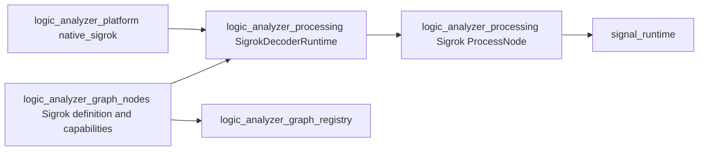

# Sigrok Python Decoder Host

## Architecture

LogicConduit can run API-version-3 Sigrok protocol-decoder scripts without linking or calling
`libsigrokdecode`. A native PyO3 host provides the Python `sigrokdecode` module contract, while
Rust owns decoder discovery, sample scheduling, retained output, graph integration, and errors.

The compatibility boundary is the public Python API used by decoder scripts. The C ABI and
`libsigrokdecode` session structures are not part of the design. The implementation may use the
upstream C source as a behavioral reference and as a differential-test oracle, but it does not
ship or invoke that library at runtime.

## Supported behavior

- The native host loads unmodified Sigrok API-version-3 Python decoder packages from configured
  search paths.
- Discovery reports decoder identity, channels, options, protocol inputs and outputs, annotations, binary
  classes, logic outputs, tags, descriptions, and license information.
- Raw-logic decoders use compatible `wait()` behavior over finite and growing captures.
- Owned protocol packets flow between independent decoder nodes for graph-defined stacking.
- Annotations and other supported outputs use registered, protocol-independent
  payload contracts.
- Graph controls, viewer lanes, and decoder-table columns derive from explicit decoder metadata.
- Generic runtime, compiler, viewer, table, and node-graph code remains independent of Sigrok and of
  individual protocols.
- Unavailable decoders and Python failures are structured node-owned diagnostics.

## Excluded behavior

- Reimplement or bind the `libsigrokdecode` C API.
- Translate individual decoder scripts to Rust.
- Infer presentation or port behavior from decoder names or annotation text.
- Guarantee support for scripts that execute external programs, import unavailable native Python
  extensions, or depend on undocumented DSView modifications.
- Embedded CPython does not execute in the wasm application; web composition advertises the
  capability as unavailable.
- Treat untrusted decoder scripts as safe. They execute arbitrary Python code with the native
  application's authority.

## Compatibility profile

The supported profile is the standard Sigrok API-version-3 contract exposed to Python:

```python
class Decoder:
    def register(self, output_type, proto_id=None, meta=None): ...
    def put(self, start_sample, end_sample, output_id, data): ...
    def wait(self, conditions=None): ...
    def has_channel(self, channel_index): ...
```

The host also supplies `OUTPUT_ANN`, `OUTPUT_PYTHON`, `OUTPUT_BINARY`, `OUTPUT_LOGIC`,
`OUTPUT_META`, `SRD_CONF_SAMPLERATE`, and the instance attributes `samplenum` and `matched`.

Decoder packages declare their schema through class attributes. Discovery validates these values
and converts them into an owned Rust descriptor before the decoder is offered to the graph UI.
Malformed or unsupported metadata makes that decoder unavailable without invalidating other
packages in the same search path.

The DreamSourceLab `libsigrokdecode4DSL` fork is a distinct compatibility profile. Its changed
annotation conventions and missing or extended output behavior are handled only through explicit
profile capabilities. They are not hidden in the standard profile or generic presentation code.

## Ownership and crate boundaries

The implementation follows the graph planning and execution boundaries:



`logic_analyzer_processing` owns the portable decoder descriptors, execution contract, configured
processing node, and output payloads. `logic_analyzer_graph_nodes` owns graph state, controls,
migration, capabilities, and presentation metadata. `logic_analyzer_platform` owns CPython,
package discovery, `wait()` scheduling, Python/Rust conversion, and the native execution-contract
implementation. PyO3 types do not cross the platform adapter boundary.

Generic components see only graph contracts, typed ports, and registered collected
payloads. They do not branch on Sigrok decoder IDs, channel labels, annotation classes, or protocol
packet contents.

## Decoder discovery

A decoder search path contains package directories whose `__init__.py` exposes a `Decoder` class.
The native host imports each package in an isolated discovery operation and reads its declarative
attributes into a `SigrokDecoderDescriptor`. The descriptor contains:

- stable decoder ID and API version;
- display name, long name, description, license, and tags;
- required and optional logic channels with stable IDs and descriptions;
- accepted protocol input IDs and emitted protocol output IDs;
- typed options, defaults, and enumerated allowed values;
- annotation classes and annotation-row membership;
- binary output classes and generated-logic channel groups;
- declared capability requirements and discovery diagnostics.

Search-path order is explicit. The first successfully discovered package for a stable ID wins and
later duplicates produce visible catalog diagnostics; filesystem order never silently decides
which implementation wins. Saved graphs retain
the decoder ID, compatibility profile, relevant package fingerprint, configured channel mapping,
options, and protocol input/output schema.

Catalog policy is independent of both host effects involved in discovery. A
`SigrokSearchPathDiscovery` implementation normalizes configured roots and enumerates decoder
packages, while `SigrokPackageDiscovery` inspects one package and returns its validated descriptor.
The native adapters use the filesystem and PyO3 host respectively. Catalog tests inject virtual
paths and descriptors, so ordering, duplicate handling, diagnostics, caching, and refresh behavior
do not import Python packages or depend on host directories.

The processing node controls execution through `SigrokExecution` and creates implementations with
`SigrokExecutionFactory`. This contract exchanges logic chunks, protocol packets, registrations,
and outputs as Rust-owned values. The native adapter alone converts `ProtocolValue` to and from
Python objects and delegates scheduling to the decoder worker. Processing-node tests inject a
deterministic execution implementation; focused adapter tests generate their own decoder package
and cover the Python boundary.

The native Preferences window owns an ordered collection of external decoder directories. Adding,
removing, or rescanning directories starts discovery on a background thread; the UI continues to
render and reports scan progress and package diagnostics. The collection is persisted in the
application configuration directory. A completed scan atomically replaces one catalog-owned set
of generic graph-node templates and cannot mutate an executing pipeline.

## Python module and instance association

The native backend inserts a PyO3-created module named `sigrokdecode` into `sys.modules` before
loading decoder packages. Its subclassable `Decoder` base class implements the four host methods.
Each Python decoder instance is associated with one Rust-owned runtime handle containing:

- its validated descriptor and selected options;
- decoder-channel to graph-input mapping;
- current absolute sample number and prior pin values;
- current wait conditions and match result;
- registered output streams;
- input and output queues;
- cancellation, EOF, and failure state.

Python-visible objects contain only an opaque handle. Rust state does not borrow Python values
across GIL releases. Runtime destruction first requests cancellation, wakes `wait()`, joins the
worker, and then releases Python objects under the GIL.

## Execution lifecycle

For a raw-logic decoder the runtime performs this sequence:

1. Construct the Python decoder and apply validated option values.
2. Call the decoder's initialization and optional samplerate `metadata()` method.
3. Call `start()` and initialize `samplenum` and `matched`.
4. Run `decode()` on a decoder worker.
5. Allow `decode()` to suspend inside the host `wait()` method.
6. Feed committed input spans from the processing pipeline to the Rust scheduler.
7. Resume Python only when a wait condition matches or termination is requested.
8. Drain converted outputs into typed processing ports and payload adapters.
9. On normal input completion, make the final committed span available and then raise `EOFError`
   from `wait()`.
10. On cancellation or failure, wake and join the worker without publishing partial output as a
    successful completion.

`wait()` releases the GIL while blocking and while Rust searches input. Python execution reacquires
the GIL only to update instance attributes and return pin values. Multiple decoder workers may wait
concurrently, although ordinary Python execution remains subject to the embedded interpreter's
GIL.

## Wait-condition semantics

The scheduler implements the API-version-3 condition language directly:

- channel level: high and low;
- channel transition: rising, falling, either edge, and no edge;
- `skip`: advance by an absolute number of sample positions;
- logical AND between entries in one condition dictionary;
- logical OR between dictionaries in a condition list;
- an empty condition: return the next available sample position;
- optional disconnected channels, represented by the Sigrok-compatible open-channel value;
- a `matched` tuple identifying every alternative condition that matched at the returned sample.

Required and optional channels are all declared as visible graph sockets. A required socket must be
connected for lowering to succeed; an optional channel is present in the decoder worker exactly
when its socket is connected, with no separate enable setting.

All positions are absolute sample numbers. Edge evaluation preserves the previous pin state across
processing chunks, including a transition at a chunk boundary. Initial pin policy is explicit and
covered by compatibility tests.

The scheduler searches compact sample-indexed transitions or capture blocks in Rust. It does not
call Python once per sample and does not expand a high-rate capture into a dense in-memory Python
sequence. Level predicates are evaluated at candidate transition and skip positions so mixed
level/edge conditions preserve sample-exact behavior.

Growing captures expose only committed input. A decoder cannot observe staged or subsequently
discarded samples. Backpressure is bounded and isolated from acquisition in the same way as other
analysis nodes.

## Graph-based decoder stacking

Decoders with raw logic input call `wait()`. Decoders with protocol inputs receive calls to
`decode(start_sample, end_sample, data)` for compatible `OUTPUT_PYTHON` packets emitted below
them.

Each decoder instance remains an independent processing node. Stack routing is expressed only by
ordinary node-graph connections; the Python host does not construct, configure, or execute a
hidden decoder stack. A graph connection is valid when the emitted protocol ID intersects the
receiving decoder's declared inputs. Routing uses those declared IDs, not decoder names.

`OUTPUT_PYTHON` therefore crosses a processing boundary as the shared, protocol-neutral
`ProtocolPacket` runtime type. Its recursive `ProtocolValue` model contains null, booleans,
integers, floats, strings, bytes, lists, tuples, and string-keyed mappings. Native decoder nodes can
emit the same type when they implement an explicitly documented protocol contract; the native I²C
decoder, for example, emits the standard Sigrok `i2c` packet vocabulary as well as native words.
A packet that cannot be represented produces a structured compatibility error. The native Sigrok
execution adapter reconstructs the corresponding Python value before invoking
`decode(start_sample, end_sample, data)`.

## Output payloads

Sigrok output kinds lower to the same standard runtime payloads used by native nodes:

- annotations become `Word` values whose numeric tag is the annotation class and whose text is
  the decoder-provided preferred label;
- binary output becomes arbitrary-width byte `Word` values whose numeric tag is the binary class;
- generated logic becomes `SampleBlock` data on a standard signal socket;
- numeric metadata becomes a `Word` retaining its numeric representation and an explicit label;
- stacked-decoder output becomes the shared `ProtocolPacket` type with a protocol ID and an
  owner-defined recursively owned value.

There are no Sigrok-specific retained payload identities, adapters, snapshots, table rows, or
viewer renderers. A Sigrok output is interchangeable with the corresponding native output at the
graph and processing boundaries.

`put()` validates output IDs, sample ranges, class indices, and value shapes at the Python boundary.
Invalid output is reported with decoder ID and Python traceback context.

The standard payload adapters own retention, snapshots, cursor snapping, decoder-table projection,
and viewer rendering. Viewer and table remain sibling subscribers and do not know whether a value
originated in Python or a native decoder.

## Graph node and saved state

One generic, restorable `Sigrok Decoder` feature represents discovered decoders. The base feature
is hidden from the Add menu. Each catalog result contributes a preconfigured Add-menu template,
grouped by its declared Sigrok tag and explicitly labeled as external Sigrok code. Instantiating a
template still creates the generic feature, so saved graphs do not depend on ephemeral template
names. Its state selects the decoder descriptor and stores options, channel mapping, compatibility
profile, and protocol input/output connections. It does not generate a Rust node type for every
Python package.

The graph model provides an instance-schema contract so inputs, outputs, and controls are derived
from validated saved state and a host-supplied decoder catalog. That contract is generic: it allows a
node owner to return an explicit socket/control schema and is not named after Sigrok or any
protocol. The schema is deterministic for a saved state and carries stable socket identities so a
catalog refresh does not reconnect edges by display position.

Graph builders may attach opaque semantic contract identities to typed outputs and inputs. The
generic compiler requires an intersection when both endpoints declare contracts, without knowing
what those identities mean. The Sigrok node owner uses declared protocol IDs for these contracts,
so incompatible decoder stacks fail during graph lowering rather than inside Python execution.

If a saved decoder is missing or its schema fingerprint changes, the node remains loadable in a
disabled state. The concrete node migration reports missing channels, options, or outputs through
a user-visible warning. Generic graph loading never guesses replacements from labels.

## Platform boundary

Embedded CPython and native threads are selected as a complete native implementation under the
Sigrok support platform module. No PyO3 type or `cfg(target_arch = "wasm32")` conditional leaks into
generic processing, graph, compiler, viewer, or UI code.

The wasm target omits the native runtime registration and CPython host. Its platform composition
does not advertise Sigrok Python decoder execution.

## Errors, trust, and distribution

Discovery, configuration, execution, and output conversion have separate structured error
boundaries. Python exceptions retain decoder identity, operation, traceback, and current sample
number. One failed decoder terminates its processing node without corrupting the collector or
other decoder instances.

Decoder scripts are trusted executable plugins. Configured directories are visible to the user,
and the application does not automatically execute decoders found in arbitrary capture or graph
directories. Decoder code runs with the native application's permissions; there is no
helper-process isolation boundary.

The application distinguishes support for external decoder directories from bundling decoder
files. Packaging work inventories decoder licenses, Python dependencies, native extensions, data
files, and subprocess use before any decoder collection is redistributed.

The native distribution policy and review boundary are defined in
[`Sigrok Decoder Distribution`](sigrok_decoder_distribution.md).

## Verification strategy

The scheduler and converters have Rust unit tests for every condition, boundary, EOF, malformed
value, and cancellation case. Processing-node tests use an injected deterministic execution
implementation. Small generated fixture decoders exercise the native adapter's Python subclassing,
metadata, options, all output types, protocol-packet conversion, exceptions, and teardown.

Compatibility tests run representative unmodified decoders over deterministic captures. A
test-only oracle may execute the same capture through `libsigrokdecode` and compare normalized
sample spans and outputs. The production dependency graph remains free of the C library.

The first end-to-end proof uses the standard SPI decoder because it exercises required and
optional channels, edge and skip waits, annotations, Python packets, and samplerate metadata.
Success requires sample-exact agreement across multiple input chunkings, including transitions at
every chunk boundary. Graph-based stacking is verified separately after the raw-logic decoder node
and owned protocol-packet boundary exist.
